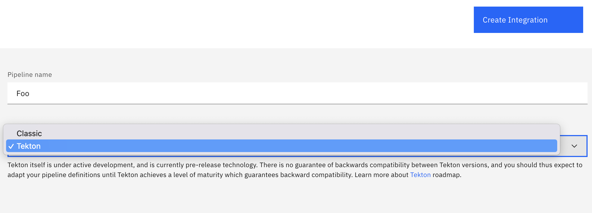

---

copyright:
  years: 2021, 2022
lastupdated: "2022-03-23"

keywords: DevSecOps, ibm cloud, tekton, classic, pipeline

subcollection: devsecops

---

{:shortdesc: .shortdesc}
{:table: .aria-labeledby="caption"}
{:external: target="_blank" .external}
{:codeblock: .codeblock}
{:pre: .pre}
{:screen: .screen}
{:tip: .tip}
{:note: .note}
{:important: .important}
{:download: .download}
{:help: data-hd-content-type='help'}
{:support: data-reuse='support'}

# Adding a pipeline to an existing toolchain
{: #devsecops-add-pipeline}

You can add a new pipeline to an existing toolchain by creating a new Delivery Pipeline tool integration.
{: shortdesc}

To add a new pipeline to an existing toolchain, complete these steps:

1. From the Toolchain Overview page, click **Add Tool +** to add a tool integration for your toolchain.

   

2. Search and click **Delivery Pipeline** tool integration tile.

   

3. Choose between Classic pipeline that is defined through the UI, or the new Tekton-based 'pipeline as code' that is defined in a Git repository. 

   Tekton pipelines are currently available only with Private Workers.
   {:  important}

4. Name your pipeline, choose the pipeline configuration method, and then select **Create Integration**. This takes you to the pipeline configuration page to finish setting it up.

5. Click **Create Integration**.

For more information about setting up a Tekton-based delivery pipeline, see [Creating a Delivery Pipeline for Tekton](/docs/ContinuousDelivery?topic=ContinuousDelivery-tekton-pipelines&interface=ui#configure_tekton_pipeline).
