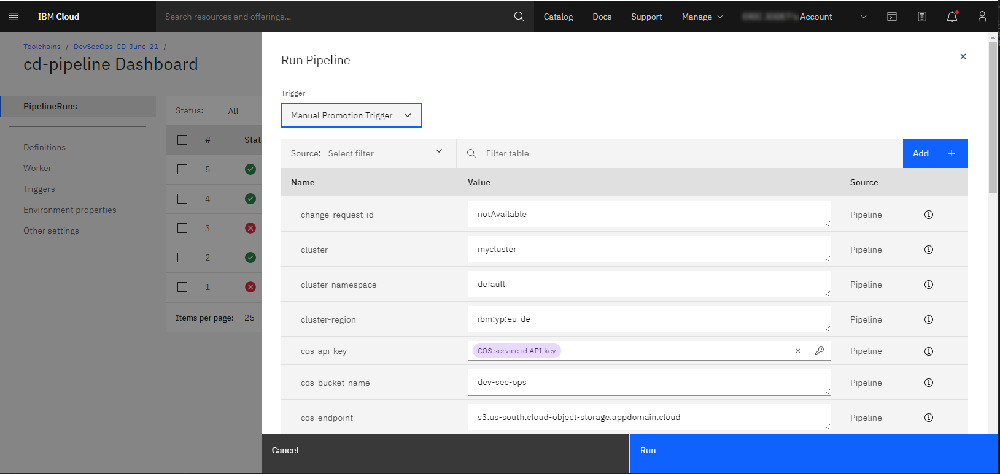
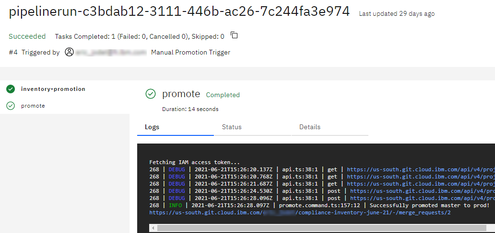

---

copyright:
  years: 2021, 2022
lastupdated: "2022-03-21"

keywords: DevSecOps

subcollection: devsecops

---

{:shortdesc: .shortdesc}
{:table: .aria-labeledby="caption"}
{:external: target="_blank" .external}
{:codeblock: .codeblock}
{:pre: .pre}
{:screen: .screen}
{:tip: .tip}
{:note: .note}
{:important: .important}
{:download: .download}
{:help: data-hd-content-type='help'}
{:support: data-reuse='support'}

# Promoting and deploying changes
{: #cd-devsecops-promote-branches}

The [DevSecOps reference implementation](/docs/devsecops?topic=devsecops-cd-devsecops-peer-review) helps to enforce the review of code changes before they are merged, promoted, and deployed to production.
{: shortdesc}

## Promoting inventory entries from source to target branches
{: #cd-devsecops-promote-entries}

To promote code changes from the source (master) branch to the target (staging, prod) branch of your inventory repository (repo), complete the following steps:

1. The continuous integration pipelines populate the source (master) branch with [inventory entries](/docs/devsecops?topic=devsecops-cd-devsecops-inventory#inventory-entry-format). Use the continuous delivery [promotion pipeline](/docs/devsecops?topic=devsecops-cd-devsecops-promotion-pipeline) to promote this content from your source (master) branch to the target (staging or prod) branch.

   * From the continuous delivery pipeline dashboard, click **Run Pipeline**. 
   * Select **Manual Promotion Trigger**.
   * Click **Run**. The pipeline-run creates a merge request to promote your code changes from the source branch to the target  branch.
 
   {: caption="Manual Promotion Trigger" caption-side="bottom"}

1. Approve and merge the pull request.

   * Click the pipeline-run and check the execution log of the promotion pipeline.
 
   {: caption="MR execution log" caption-side="bottom"}
 
   * Locate the URL of the merge request and open the merge request.
   * Populate the [required fields](/docs/devsecops?topic=devsecops-cd-devsecops-promotion-pipeline#cd-devsecops-promotion-pipelineoutputs) (Priority, Change Request assignee, Additional Description, and other fields).
   * Merge the merge request to promote your changes from the source branch to the target branch.

Now that your changes are promoted to the target branch, you can deploy them by using the [continuous delivery pipeline](/docs/devsecops?topic=devsecops-tutorial-cd-devsecops#devsecops-cd-toolchain-cd-pipeline-run).

## Deploying changes from the source-environment to the target-environment
{: #cd-devsecops-deploy-branches}

The source and target environments are defined at the continuous delivery pipeline level.

{: caption="Continuous delivery pipeline properties" caption-side="bottom"}

Depending on the continuous delivery pipeline [trigger settings](/docs/devsecops?topic=devsecops-cd-devsecops-triggers), the pipeline is either automatically triggered after a merge request is merged or the pipeline is merged manually. To manually merge the pipeline, click **Run Pipeline** and choose the trigger to run.
 
The pipeline starts and tags the current commit in the inventory repo with the Pipeline Run ID. The pipeline uses that tag to pick up the content from the target branch (prod) and calculates the deployment delta between the current commit and the content of the last successful deployment. The delta is identified by the `<target-environment>_latest` tag, where `target-environment` is the value that is set in your continuous delivery pipeline properties, such as `prod_latest`.

The pipeline attempts to deploy the content. During the deployment, the change request ID is attached to the commit that the pipeline works with as a tag. A successful deployment concludes by attaching the `<target-environment>_latest` tag to the commit that you promoted.

{: caption="GRIT repo tags" caption-side="bottom"}

For more information about the inventory workflow, see [Understanding DevSecOps pipelines](/docs/devsecops?topic=devsecops-cd-devsecops-pipelines#cd-devsecops-pipelines-inventory-workflow).
