---

copyright:
  years: 2021, 2022
lastupdated: "2022-05-10"

keywords: DevSecOps, CI, compliance, secure toolchain, IBM Cloud

subcollection: devsecops

---

{{site.data.keyword.attribute-definition-list}}

# Setting up Tekton continuous integration pipelines with DevSecOps
{: #cd-devsecops-tekton-ci-compliance}

Complete these steps to set up the Tekton continuous integration pipelines with compliance. Recommended configuration options guide you through the steps to create your toolchain.
{: shortdesc}

## Before you begin
{: #cd-devsecops-tekton-ci-prereq}

* [Create a Kubernetes cluster](/docs/containers?topic=containers-getting-started) on IBM Cloud Kubernetes Service to deploy your application.
* [Install the {{site.data.keyword.cloud_notm}} CLI](/docs/containers?topic=containers-getting-started) on your operating system to interact with {{site.data.keyword.cloud_notm}} resources.
* [Create an image signing key](/docs/devsecops?topic=devsecops-devsecops-image-signing) with proper encoding to sign your application docker images.
* [Create toolchain secrets](/docs/devsecops?topic=devsecops-cd-devsecops-toolchains-secrets) to access different integrations and secure them.
* Optional. [COS Bucket](/docs/devsecops?topic=devsecops-cd-devsecops-cos-config) as the compliance evidence locker to durably store pipeline run evidence.
* [Validate recommended IAM permissions](/docs/devsecops?topic=devsecops-cd-devsecops-iam-permissions) are assigned to corresponding integrations.

## Guided setup overview for the CI toolchain
{: #cd-devsecops-tekton-ci-guided}

View the following video tutorial to get an overview of the setup process:

{: video output="iframe" data-script="none" id="watsonmediaplayer" width="560" height="315" scrolling="no" allowfullscreen webkitallowfullscreen mozAllowFullScreen frameborder="0" style="border: 0 none transparent;"}

{: caption="DevSecOps Continuous Integration toolchain welcome page" caption-side="bottom"}

A progress indicator shows your progress in completing the configuration. If you need to return to a previous step, you can use the progress indicator to navigate to a previous step. 

The configuration options for the current step are displayed in the main area of the page.

To advance to the next step, click **Continue**. You can advance to the next step only when the configuration for the current step is complete and valid. You can navigate to the previous step by clicking **Back**.

Some steps might have a **Switch to advanced configuration** toggle. These steps present you with the minimum recommended configuration. However, advanced users that need fine-grained control can click the **Switch to advanced configuration** toggle to see all options for the underlying integration.

{: caption="DevSecOps advanced configuration toggle" caption-side="bottom"}

After you successfully complete all of the steps, click **Create** to create the toolchain.

You can return to previous steps in the guided installer. The toolchain installer retains all of the configurations that you completed.
{: tip}

## Start the CI toolchain setup
{: #devsecops-ci-tekton-setup}
{: step}

Start the CI toolchain configuration by using one of the following options:

* Click the following **Create toolchain** button.

   

* From the {{site.data.keyword.cloud_notm}} console, click the **Menu** icon  and select **DevOps**. On the Toolchains page, click **Create toolchain**. On the Create a Toolchain page, click **CI-Develop with DevSecOps practices**.

## Set up the CI toolchain name and region
{: #devsecops-ci-tekton-name-region}
{: step}

Review the default information for the toolchain settings. The toolchain's name identifies it in {{site.data.keyword.cloud_notm}}. Make sure that the toolchain's name is unique within your toolchains for the same region and resource group in {{site.data.keyword.cloud_notm}}.

The toolchain region can differ from cluster and registry region.
{: note}

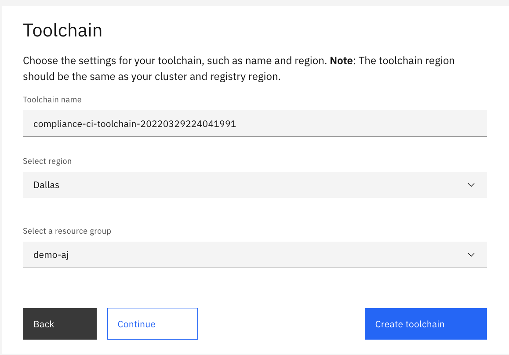{: caption="DevSecOps CI toolchain name and region" caption-side="bottom"}

## Set up CI tool integrations
{: #devsecops-ci-tekton-tool-integrations}
{: step}

Multiple repositories must be configured during the guided setup, as described in the next sections.

For each repository, either clone the repository that's provided as a sample, or provide a URL to an existing IBM-hosted Git Repos and Issue Tracking (GRIT) repository that you own. The toolchain supports linking only to existing GRIT repositories.

### Application
{: #devsecops-ci-tool-app}

The Application step that refers to the application source code repository is shown in the following image.
  
{: caption="DevSecOps application repository" caption-side="bottom"}

The recommended options are displayed by default, but you can click the **Switch to advanced configuration** toggle to see all of the configuration options available for the underlying Git integration. The default behavior of the toolchain is `Use default sample` that clones the sample application as IBM-hosted GRIT Repository.

Enter the name of the IBM-hosted GRIT repository that was created by the toolchain as your application repository.

The region of the repository remains the same as the region of the toolchain.

If you want to link an existing Application Repository for the toolchain, select the `Bring your own app` option, and provide it as input to `Repository URL` field. As noted earlier, the toolchain currently supports linking only to existing GRIT repositories. If you want to know more about `Bring your own app`, see [Bringing your own app to DevSecOps](/docs/devsecops?topic=devsecops-cd-devsecops-apps-byoa).

### Inventory
{: #devsecops-ci-tool-inventory}

Change management is tracked in this repository. CD pipeline creates a new branch that is named as the created CR number, and merges it to master after deployment is concluded. 

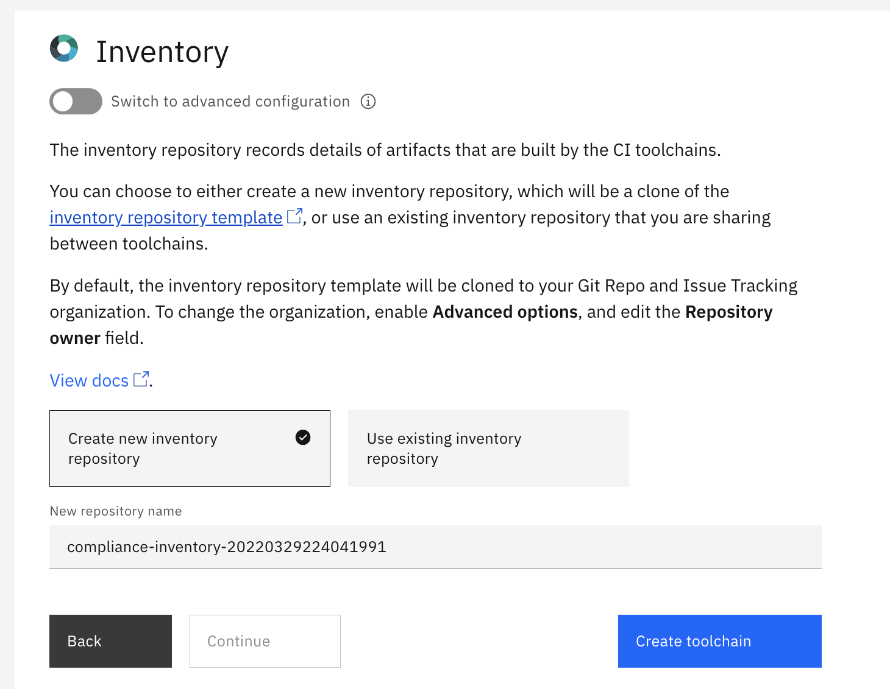{: caption="DevSecOps inventory repository" caption-side="bottom"}

The default behavior of the toolchain is to `Create new inventory` that creates a new Inventory Repository as IBM hosted GRIT Repository. If you want to link an existing Inventory Repository for the toolchain, you may choose `Use existing inventory` option and provide it as input to `Repository URL` field. As noted earlier, the toolchain currently supports linking only to existing GRIT repositories.

- **New repository name**: Name of the IBM hosted GRIT Repository created by the toolchain as your inventory repository. The region of the repository remains the same as that of the toolchain.

### Issues
{: #cd-devsecops-issues-ci}

Issues about incidents that are captured during the build and deployment process are tracked in the repository.

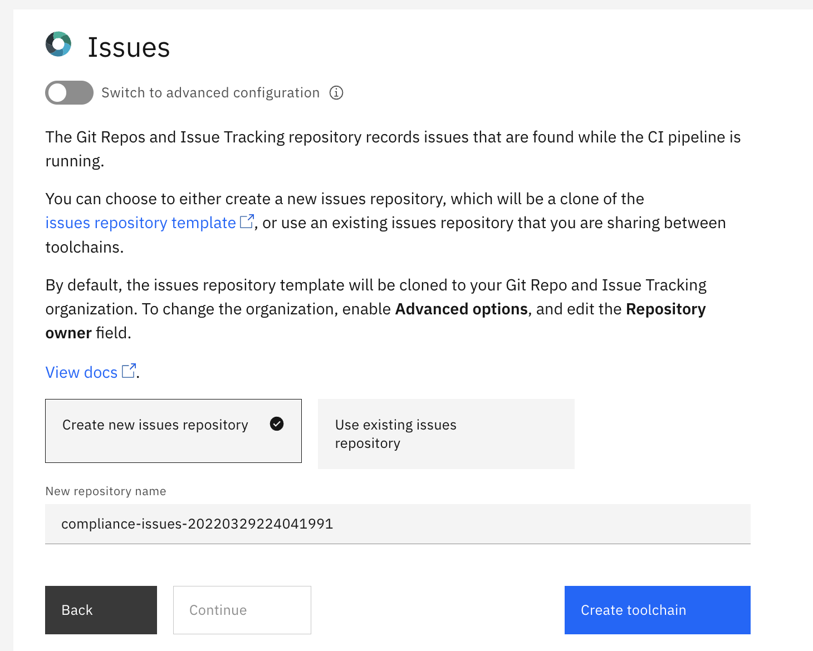{: caption="DevSecOps Issues repository" caption-side="bottom"}

The default behavior of the toolchain is to `Create new issues repository` that creates a new repository as IBM hosted GRIT Repository. In case you want to link an existing Issues Repository for the toolchain, you can choose `Use existing issues repository` option and provide it as input to `Repository URL` field. As noted earlier, the toolchain currently supports linking only to existing GRIT repositories.

- **New repository name**: Name of the IBM hosted GRIT Repository created by the toolchain as your inventory repository. The region of the repository remains the same as that of the toolchain.

### Secrets
{: #cd-devsecops-secrets-ci}

Several tools in this toolchain require secrets to access privileged resources. An {{site.data.keyword.cloud_notm}} API key is an example of such a secret. All secrets must be stored securely in a secrets vault and then referenced as required by the toolchain. 

The **Secrets** step specifies which secret vault integrations are added to your toolchain. Use the provided toggles to add or remove the vault integrations that you require. However, these can be configured in subsequent steps. Also, familiarize yourself with the concepts in the [Protecting your sensitive data in Continuous Delivery](/docs/ContinuousDelivery?topic=ContinuousDelivery-cd_data_security#cd_secure_credentials) documentation because this provides important information about preconfiguring your vault providers and integrations.

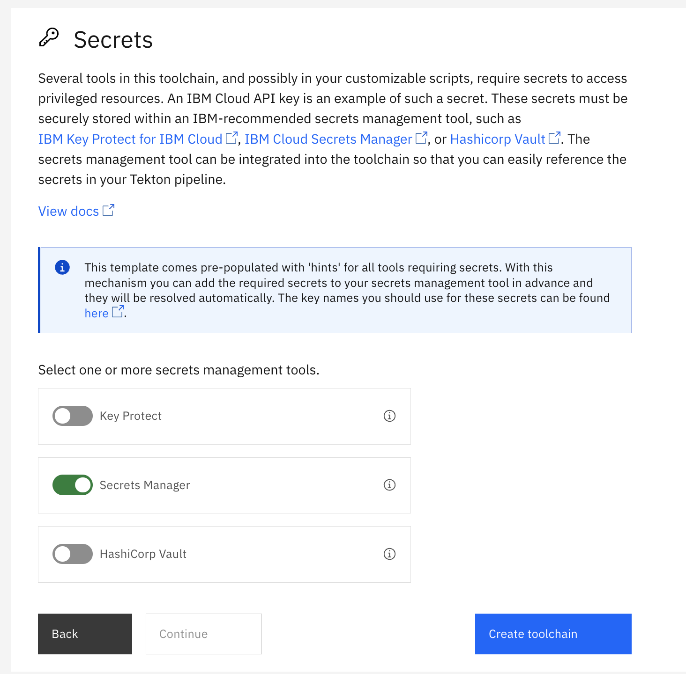{: caption="DevSecOps secrets options" caption-side="bottom"}

If you plan to use IBM Key Protect or HashiCorp vault for managing your secrets, see the [IBM Key Protect section of the CI setup guide](/docs/devsecops?topic=devsecops-cd-devsecops-tekton-ci-compliance#cd-devsecops-key-protect-ci).

#### IBM Key Protect
{: #cd-devsecops-key-protect-ci}

Use [Key Protect](https://cloud.ibm.com/catalog/services/key-protect) to securely store and apply secrets like API keys, Image Signature, or HashiCorp credentials that are part of your toolchain. You must create a Key Protect Service Instance before proceeding further. If you already created a Key Protect Service Instance as prerequisite, you can link the same in this step.

{: caption="Key Protect" caption-side="bottom"}

- **Name**: Name of Key Protect instance created by the toolchain. This key protect instance can be accessed by this name during various stages of the toolchain setup.
- **Region**: Region in which the Key Protect service is located.
- **Resource Group**: Resource Group that the Key Protect service belongs.
- **Service name**: Key Protect service name.

To comply with best practices for using Hashicorp Vault, this template includes a Key Protect tool integration to securely manage the HashiCorp `Role ID` and `Secret ID`. By storing these HashiCorp secrets in Key Protect as a prerequisite for users to create toolchains, you protect access to HashiCorp Vault, which is the default secrets repo for most consumers.

#### IBM Secrets Manager
{: #cd-devsecops-secrets-manager-ci}

Use [Secrets Manager](https://cloud.ibm.com/catalog/services/secrets-manager) to securely store and apply secrets like API keys, Image Signature, or Hashicorp credentials that are part of your toolchain. You must create a Secrets Manager Service Instance before proceeding further. If you created a Secrets Manager Service Instance as prerequisite, you can link the same in this step.

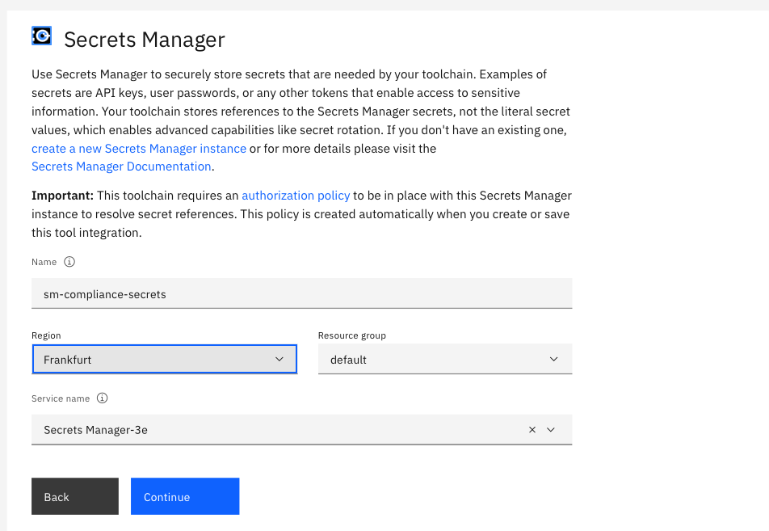{: caption="DevSecOps IBM Secrets Manager" caption-side="bottom"}

- **Name**: Name of Secrets Manager instance created by the toolchain. This Secrets Manager instance can be accessed by this name during various stages of the toolchain setup.
- **Region**: Region in which the Secrets Manager service is located.
- **Resource Group**: Resource Group to which the Secrets Manager service belongs.
- **Service name**: Secrets Manager service name.

#### HashiCorp Vault
{: #cd-devsecops-vault-ci}

Use HashiCorp Vault to securely store secrets that are needed by your toolchain. Examples of secrets are API keys, user passwords, or any other tokens that enable access to sensitive information. Your toolchain stores references to the HashiCorp secrets, not the literal secret values, which enable advanced capabilities like secret rotation.

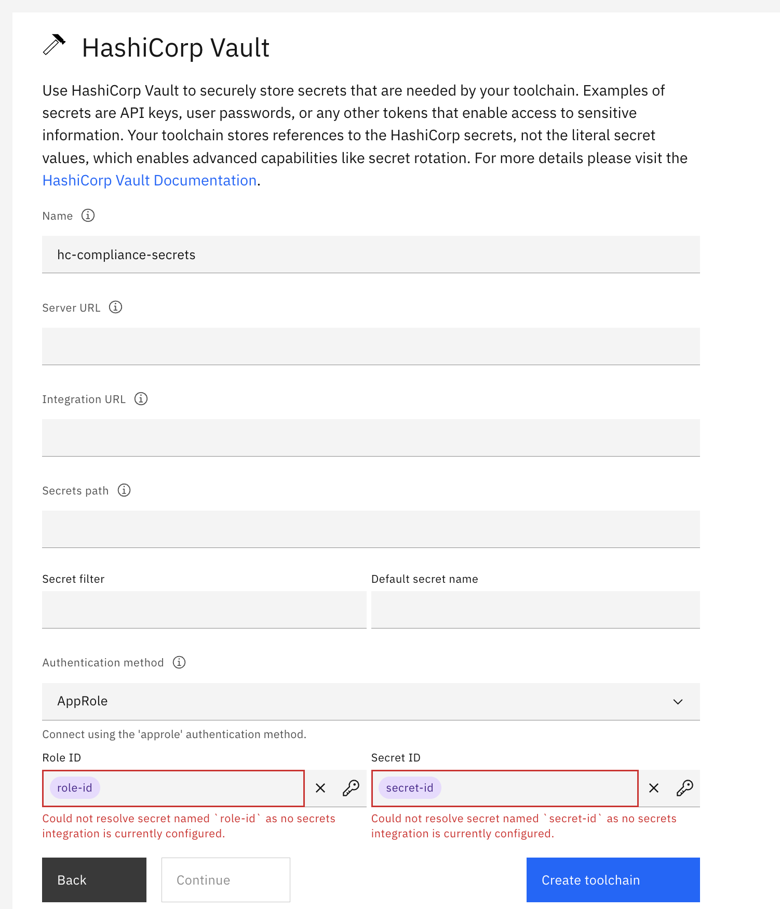{: caption="HashiCorp Vault" caption-side="bottom"}

- **Name**: A name for this tool integration. This name is displayed in the toolchain.
- **Server URL**: The server URL for your HashiCorp Vault Instance. (for instance `https://192.168.0.100:8200`)
- **Integration URL**: The URL that you want to navigate to when you click the HashiCorp Vault Integration tile.
- **Secrets Path**: The mount path where your secrets are stored in your HashiCorp Vault Instance.
- **Authentication Method**: The Authentication method for your HashiCorp Vault Instance.
- **Role ID:** Your team's [AppRole Role ID](https://www.hashicorp.com/blog/authenticating-applications-with-vault-approle).
- **Secret ID:** Your team's [Secret ID](https://www.hashicorp.com/blog/authenticating-applications-with-vault-approle).

Note: _We advise you to use AppRole authentication method as this method can be used to read secret values._

### Evidence Storage
{: #cd-devsecops-evidence-storage-ci}

All raw compliance evidence that belongs to the application is collected in this repository. Use this repository option for evaluation purposes only. 

The default behavior of the toolchain is to `Create new evidence locker repository` that creates a new repository as IBM hosted GRIT Repository. If you ant to link an existing Evidence Locker for the toolchain, choose `Use existing evidence locker` option and provide it as input to `Repository URL` field. As noted earlier, the toolchain currently supports linking only to existing GRIT repositories.

However, you must collect and store all the evidences in a Cloud Object Storage bucket that can be configured as described in the following image.

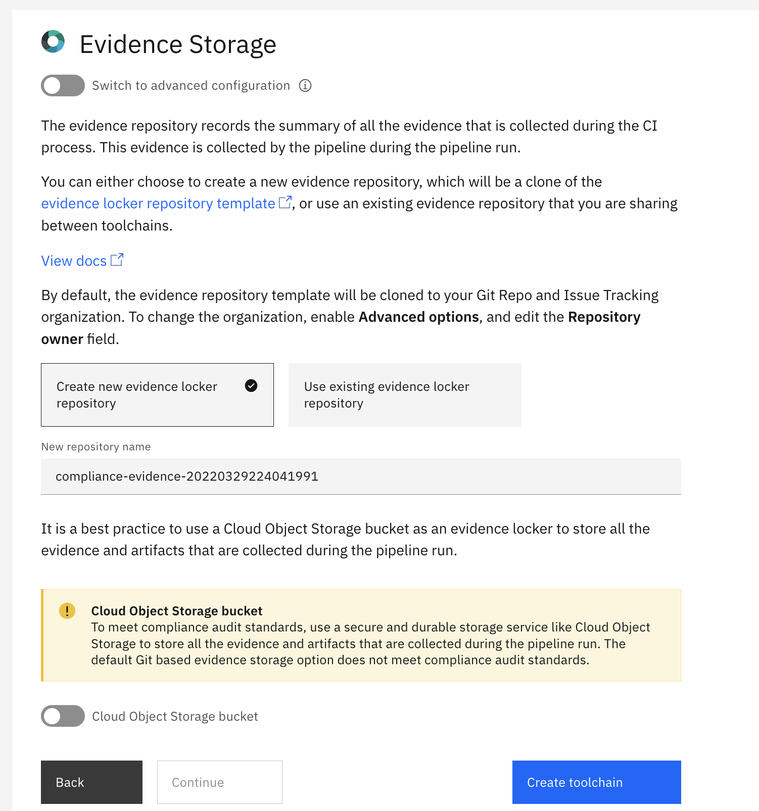{: caption="DevSecOps Evidence Storage" caption-side="bottom"}

### Cloud Object Storage Bucket
{: #cd-devsecops-cos-bucket-ci}

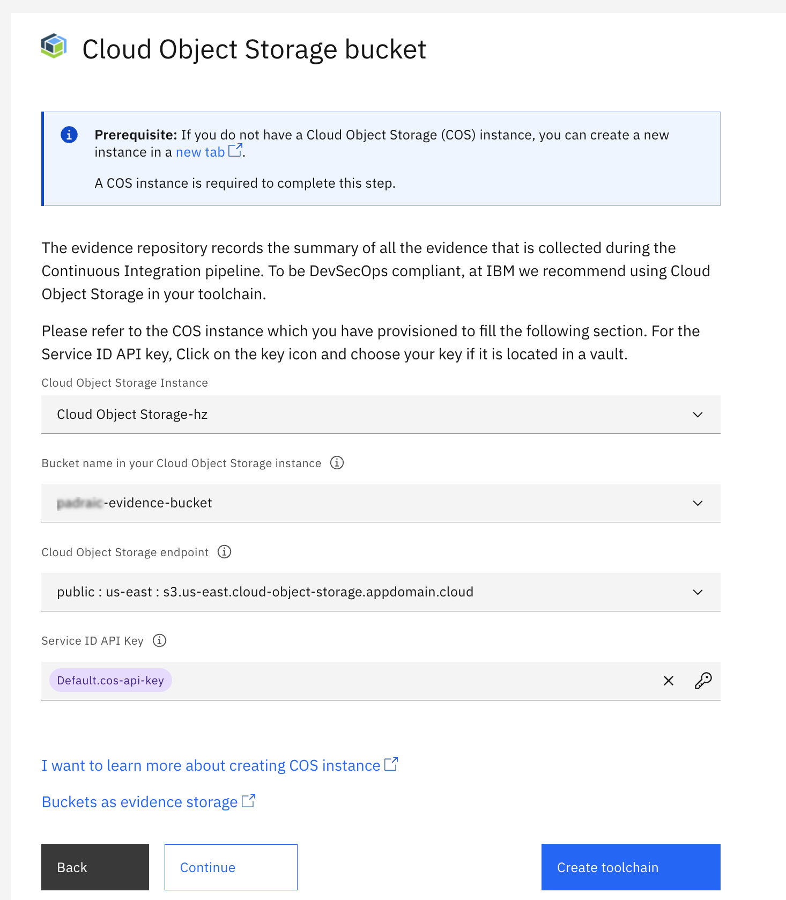{: caption="COS bucket toggle" caption-side="bottom"}

[Cloud Object Storage](/docs/cloud-object-storage?topic=cloud-object-storage-about-cloud-object-storage) is used to store the evidence and artifacts that are generated by the DevSecOps Pipelines. If you want to use this feature, you must have a Cloud Object Storage instance and a Bucket. Read the recommendation for configuring a Bucket that can act as a Compliance Evidence Locker.

You can optionally set any kind of Cloud Object Storage bucket as a locker, even without a retention policy. The pipeline doesn't check or enforce settings at the moment. For help, see the [Cloud Object Storage documentation](/docs/cloud-object-storage?topic=cloud-object-storage-getting-started-cloud-object-storage).
{: note}

You need to provide the following information for the Pipelines to reach the bucket:
* Cloud Object Storage endpoint
* Bucket name
* Service API key

You can set up the Cloud Object Storage locker later, by providing the necessary cos-bucket-name and cos-endpoint. To remove the Cloud Object Storage bucket, use the Cloud Object Storage bucket toggle in the previous step.

To get the Cloud Object Storage Endpoint, refer to your Cloud Object Storage instance's page, and select the 'Endpoints' section in the menu. You need to copy the public endpoint that matches the bucket's region and resiliency.

{: caption="DevSecOps Cloud Object Storage Endpoint menu" caption-side="bottom"}

If you decide not to use Cloud Object Storage as an evidence locker, you can also set the required values after the creation of the toolchain by setting the cos-bucket-name, cos-endpoint environment variables in the CI Pipeline.

### Deploy
{: #cd-devsecops-deploy-ci}

The default behavior of the toolchain is to `Clone existing pipeline` that creates a new repository as IBM hosted GRIT Repository. If you want to link an existing Pipeline Repository for the toolchain, choose `Use existing repository` and provide it as input to `Repository URL` field. As noted earlier, the toolchain currently supports linking only to existing GRIT repositories.

- **App name:**

The name of the application.
    - Default: `hello-compliance-app`

### IBM Cloud API Key
{: #devsecops-ci-tool-integration-api-key}

The API key is used to interact with the ibmcloud CLI tool in several tasks. If you already created a cluster, an API to access the cluster and stored the key in a secure vault (any of Key Protect, Secrets Manager, or HashiCorp Vault), as prerequisite you can use the same in this step.
* Option-1: An existing key can be imported from an existing Secret Provider instance that is created as prerequisites (Key Protect Instance, Secret Manager Instance, or HashiCorp Vault) by clicking the key icon (Recommended)
* Option-2: An existing key can be copy and pasted (Not Recommended)
* Option-3: A new key can be created from here by clicking the `New +`. Generate a new api-key if you don’t have one or copy an existing key to the field. The newly generated API key can be saved to an existing Key Protect instance.

The newly generated API key can be saved to an existing Key Protect instance.
{: tip}

{: caption="DevSecOps API key" caption-side="bottom"}

Click the Key Icon to use an existing key from your Secret Provider.
* **Provider**: The Secret Provider that stores your API Key to access the cluster, as linked to your toolchain earlier. It can be a Key Protect Instance, Secret Manager Instance, or Hashicorp Vault Instance.
* **Resource Group**: Resource Group that the Secrets Manager Provider belongs.
* **Secret name**: Name/Alias of the secret, such as the API Key.

Using the API key that is either created, retrieved from a vault, or manually entered the following fields load automatically if the API key has sufficient access. If the API key is valid, the Container registry region and namespace Cluster region, name, namespace, and Resource group is automatically populated. Change any of these fields to match your configuration if needed.

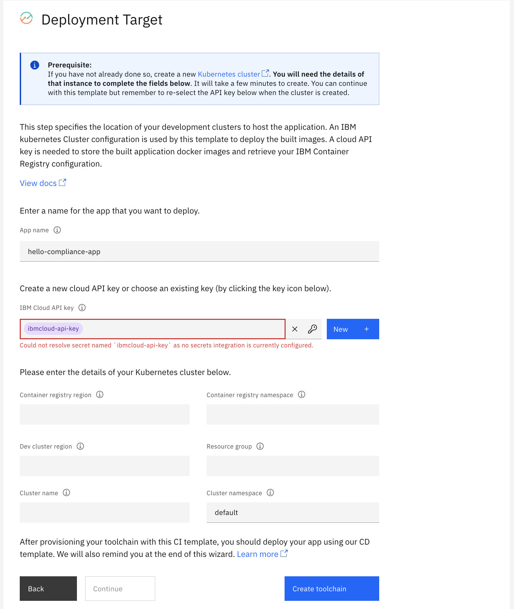{: caption="DevSecOps Deployment Target" caption-side="bottom"}

### Inventory target and source branches
{: #ci-tool-integration-inventory-branches}

* **Inventory Source Environment**: The environment from where you want to promote the application Default: master
* **Inventory Target Environment**: The environment to where you want to deploy the application Default: prod
* **Target Region**: The target region to where the application is deployed (Optional)
* **Emergency Label for change request PRs and issues**: Label on Change Request to be used for Emergency deployment

### Image signing
{: #ci-image-signing}

Any images that are built by this toolchain and recorded in the inventory must be signed before they can be deployed to production. The pipeline uses [Skopeo](https://github.com/containers/skopeo) as default tool to provide Image signing capability. You can use an existing GPG Key or create a new [GPG Key Pair](/docs/devsecops?topic=devsecops-devsecops-image-signing).

Ensure that the key follows the appropriate encoding as required by the chosen tool to store secrets.
{: note}

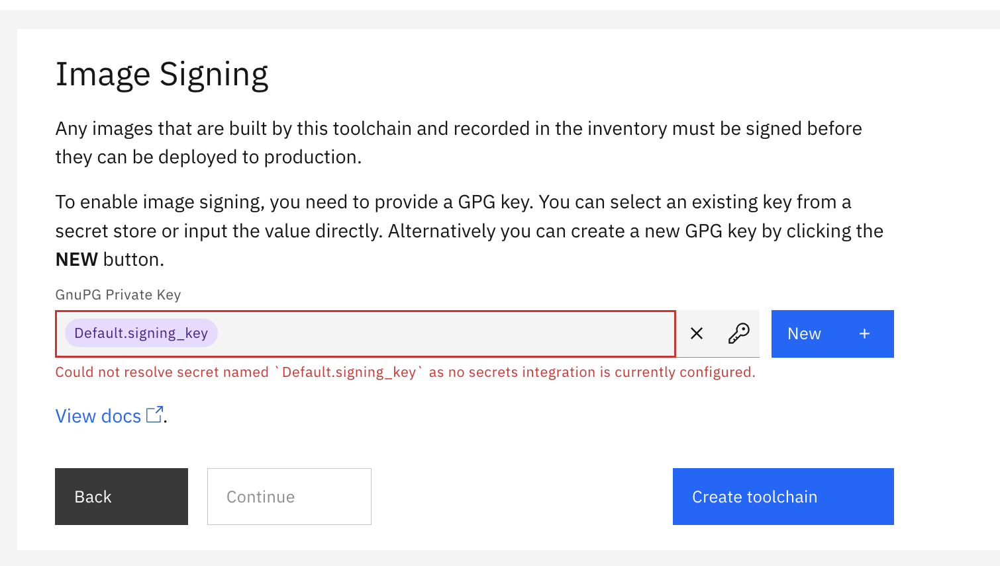{: caption="DevSecOps Image Signing" caption-side="bottom"}

Click `Key` to use an existing key from your Secret Provider.

- **Provider**: The Secret Provider, which stores your GPG Key. It can be a Key Protect Instance, Secret Manager Instance, or Hashicorp Vault Instance.
- **Resource Group**: Resource Group that the Secrets Manager Provider belongs.
- **Secret name**: Name/Alias of the secret, that is, GPG Key.

### DevOps Insights
{: #devsecops-tekton-tool-integration-insights}

[IBM Cloud DevOps Insights](/docs/ContinuousDelivery?topic=ContinuousDelivery-di_working) is included in the created toolchain and after each compliance check evidence is published into it. You do not need to provide any configuration steps for DevOps Insights, the CI pipeline  automatically uses the insights instance included in the toolchain. DevOps Insights aggregates code, test, build, and deployment data to provide visibility into the velocity and quality of all your teams and releases.

### Optional tools
{: #cd-devsecops-optional-tools-ci}

#### Slack
{: #cd-devsecops-slack-ci}

If you want to receive notifications about your PR/CI Pipeline events, you can configure the Slack Tool during the setup from the toolchain template, or you can add the Slack Tool later.

In order for a Slack channel to receive notifications from your tools, you need a Slack webhook URL. To get a webhook URL, see the Incoming Webhooks section of the [Slack API website](https://api.slack.com/messaging/webhooks).

{: caption="Slack tool" caption-side="bottom"}

#### Common DevOps Insights Toolchain
{: #cd-devsecops-insights-toolchain-ci}

DevOps Insights can optionally be included in the created toolchain and after each compliance check evidence is published into it. The toolchain can use an existing DevOps Insights instance to publish the deployment records to insights. You can link DevOps Insights integration from another toolchain by providing the Integration ID.

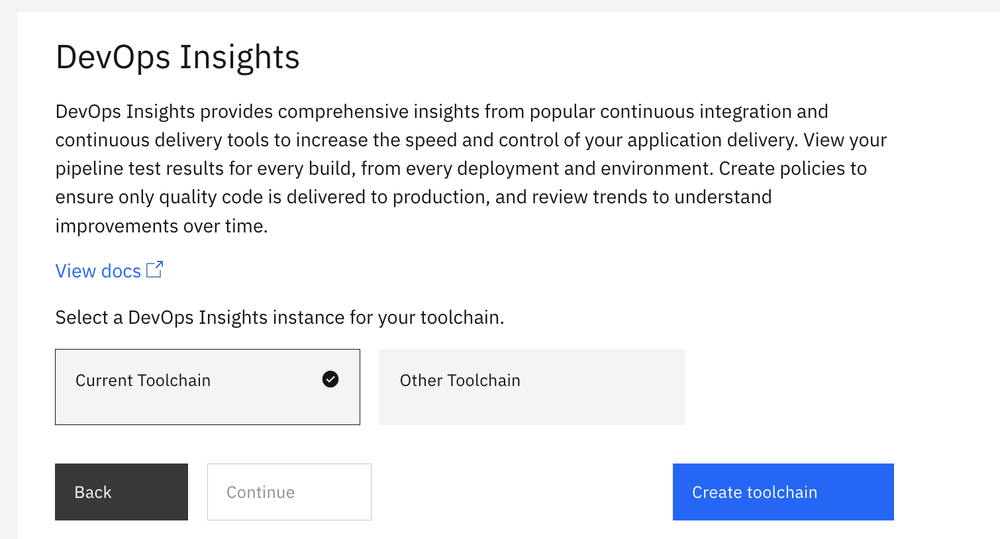{: caption="DOI Toolchain ID" caption-side="bottom"}

You can copy the Toolchain ID from the URL of your toolchain.
A toolchain's URL follows this pattern: `https://cloud.ibm.com/devops/toolchains/<toolchain-ID-comes-here>?env_id=ibm:yp:us-south`

For example, if the URL is: `https://cloud.ibm.com/devops/toolchains/aaaaaaa-bbbb-cccc-dddd-eeeeeeeeeeee?env_id=ibm:yp:us-south` then the toolchain's ID is: `aaaaaaa-bbbb-cccc-dddd-eeeeeeeeeeee`.

**Note**: _Include the ID only, not the full URL._

You can also set a target environment for the DOI interactions. This parameter is optional. If you provide this parameter, it is used instead of the target environment from the inventory.

#### DevOps Insights
{: #cd-devsecops-devops-insights-ci}

Use this option to create a new instance of DevOps Insights to be used for the toolchain. No configuration is required and the toolchain creates a new instance of DevOps Insight if this option is selected. The CI pipeline automatically uses the insights instance that is included in the toolchain.

#### Orion WebIDE
{: #cd-devsecops-webide-ci}

The Eclipse [Orion Web IDE](/docs/ContinuousDelivery?topic=ContinuousDelivery-web_ide) is a browser-based development environment where you can develop for the web in JavaScript, HTML, and CSS with the help of content assist, code completion, and error checking. 

#### Delivery Pipeline Private Worker
{: #ci-tool-integration-optional-private-worker}

The [Delivery Pipeline Private Worker](/docs/ContinuousDelivery?topic=ContinuousDelivery-private-workers) tool integration connects with one or more private workers that can run Delivery Pipeline workloads in isolation.

#### SonarQube
{: #cd-devsecops-sonar-ci}

Configure SonarQube as the static code analysis tool for the toolchain. SonarQube provides an overview of the overall health and quality of your source code and highlights issues that are found in new code. The static code analyzers detect tricky bugs, such as null-pointer dereferences, logic errors, and resource leaks for multiple programming languages.

With **Default Configuration**, the pipeline provisions a new SonarQube instance in the Kubernetes cluster that is configured in the **Deploy** step. This instance is provisioned during the first pipeline run and remains available to all the subsequent pipeline runs.

If you want the toolchain to use an existing SonarQube Instance that you have provisioned on another host, use the **Custom Configuration** option.

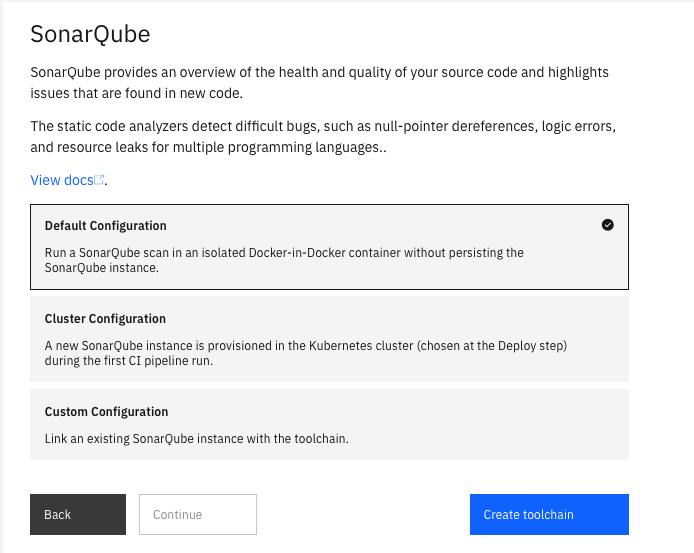{: caption="SonarQube tool" caption-side="bottom"}

## Create the CI toolchain
{: #cd-devsecops-tekton-ci-create}
{: step}

 **Create toolchain:**

- Click the `Create` in the **Summary** step and wait for the toolchain to be created.

   You can configure the individual toolchain integrations after the pipeline is created.
   {: tip}

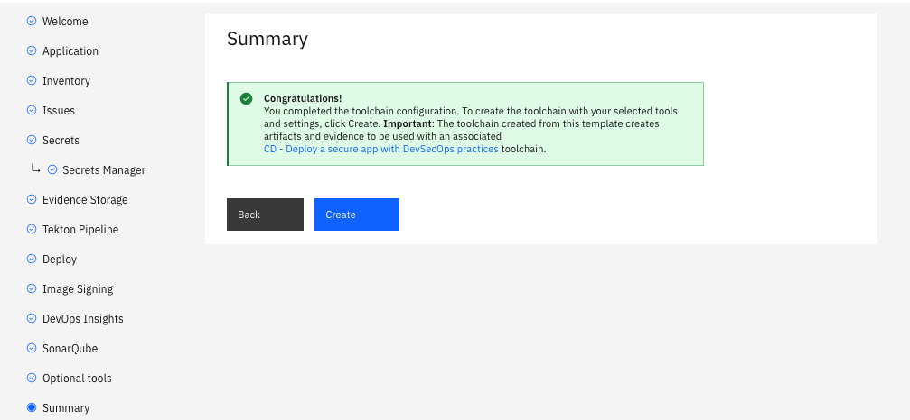{: caption="DevSecOps Summary" caption-side="bottom"}

## Explore the CI toolchain
{: #ci-toolchain-explore}
{: step}

The created CI toolchain looks like this:

{: caption="DevSecOps Continuous Integration Toolchain" caption-side="bottom"}

It contains two pipelines:

* **PR**: triggers when a new PR is submitted in the app repository
* **CI**: manually run or triggers when a PR is merged to master in the app repository

## Run the PR-CI Pipeline
{: #cd-devsecops-tekton-ci-run-pipeline}

To start the PR pipeline, you should create a merge request in your application repository. To achieve this, do the following:
1. On the CI toolchain page, click the application repository tile. By default it gets created with a name `compliance-app-<timestamp>`.
1. Create a branch from master.
1. Update some code like in app or readme file and save changes.
1. Submit merge request.
1. Back on the CI toolchain page, click the `pr-pipeline` tile. Tthe PR pipeline is initiated.

The corresponding Merge Request in your application repository is in "Pending" state until all the stages of PR Pipeline finish successfully.

After the PR Pipeline run is successful, you can click it to explore numerous steps completed.

{: caption="DevSecOps PR Pipeline Successful" caption-side="bottom"}

1. Navigate back to the merge request.
1. Merge the request so that your changes are copied to the master branch of your application repository: the CI pipeline is automatically triggered.

Simplified flow of tasks in the pipeline: (Utility tasks are omitted. For example, status-check update on GitHub, credential fetching, and so on).

{: caption="DevSecOps PR Tasks" caption-side="bottom"}

In the DevSecOps world, shift left is a practice that prevents and finds issues like defects, security vulnerabilities. Shift left also performs compliance checks early in the software delivery process.

* Checks that can be run on the code/repository and do not need the built image should be run as early as possible to prevent noncompliant code from being merged to master branch of repository. Evidence is not collected from the PR pipeline, its goal is to shift compliance checks, as far left as possible.
* All checks are done every pipeline run, even if a previous check fails, the pipeline progresses to the next one. To evaluate if you have any failures in your run, you need to check the final step of your pipeline, which has a pipeline evaluator.
* If you are trying to merge an emergency fix, and want to bypass compliance checks, add a label to your merge request to indicate this. The same label must be provided when running the CD pipeline.

### Run PR Pipeline
{: #cd-devsecops-run-pr-pipeline}

- To start the PR pipeline, create a pull request in your application repository.

- The corresponding Merge Request in your application repository is in "Pending" state until all the stages of PR Pipeline finishes successfully.  

### Run CI Pipeline
{: #cd-devsecops-run-ci-pipeline}

There are two ways to start a CI pipeline:
* Automatically: after a successful PR pipeline, by approving and merging the PR to the master branch.
* Manually: to trigger the CI pipeline manually, select the Delivery Pipeline card and click **Run Pipeline** and select `Manual Trigger`.

In this document, the CI Pipeline was triggered after you merged your code changes to the master branch of your application repository.
1. On the CI toolchain page, click the `ci-pipeline` tile.
1. Observe: a pipeline-run is running. Wait for the pipeline-run to complete.

After the CI Pipeline run is successful, you can click it to explore the completed steps.

{: caption="DevSecOps CI Pipeline Successful" caption-side="bottom"}

Simplified flow of tasks in the pipeline: (Again, utility tasks are omitted. For example, status-check update on GitHub, credential fetching, and so on) Green colored tasks are outputting evidence.

{: caption="DevSecOps CI Tasks" caption-side="bottom"}

Evidence is collected from all compliance checks in the CI pipeline, to the evidence-locker repository, that was provided during toolchain setup. Evidence from CI is stored under `raw/ci/<pipeline-run-id>/*.json`.

Evidence is also published to the DevOps Insights instance inside the toolchain. You can navigate to it by clicking the DevOps Insights toolcard in the toolchain. You can review the collected evidence on the Quality Dashboard page.

{: caption="DevSecOps CI Evidence" caption-side="bottom"}

To evaluate if you have any failures in your pipeline run, you need to check the final step of your pipeline, which has a pipeline evaluator.
{: note}

### Viewing the running application
{: #ci-toolchain-view-app}

After a successful CI pipeline run, the sample application is deployed on your Kubernetes cluster, and is running in the dev namespace.

The app url can be found at the end of the log of the `run stage` step of `deploy-dev` task of the CI Pipeline run. Use that url to verify that the app is running.

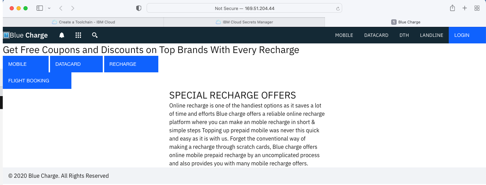{: caption="DevSecOps CI sample app" caption-side="bottom"}

## Configure Pipeline
{: #cd-devsecops-config-pipeline-ci}

You can add a `commit-id` text property (click `Add property` button and select `"Text property"`), if you trigger the pipeline manually. If no `commit-id` is supplied, the Pipeline will take the latest commit ID from the master branch of your app.

For example:

{: caption="commit-id" caption-side="bottom"}

Add the trigger parameters (click `Run Pipeline` button), select `"Manual Trigger"` and click `Run`.

{: caption="CI Trigger" caption-side="bottom"}
