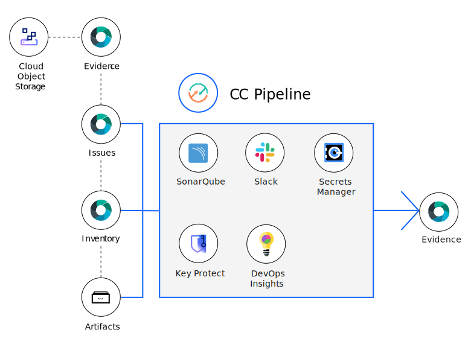
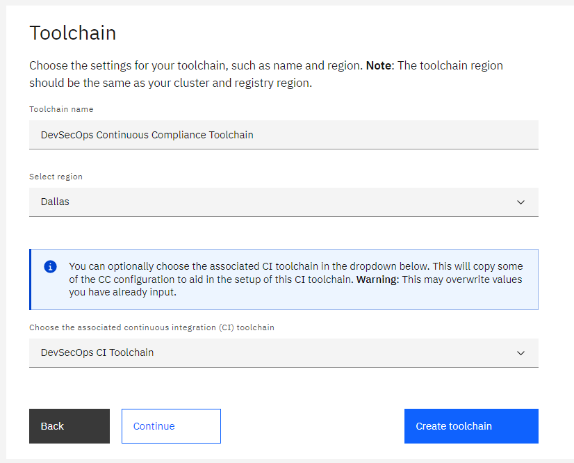
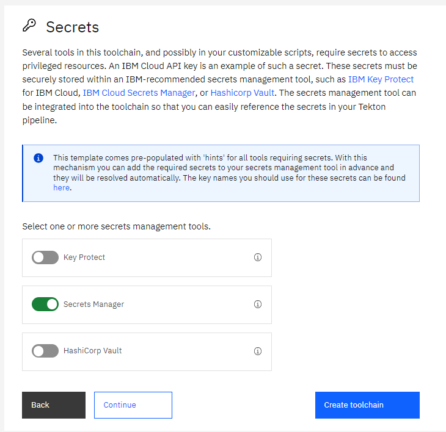
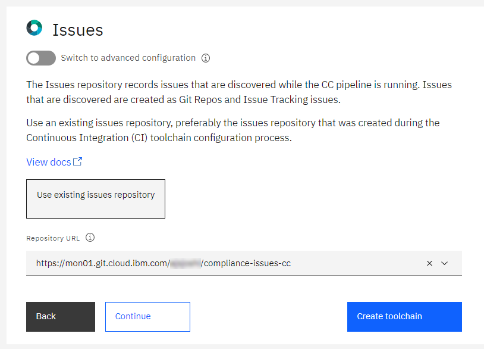
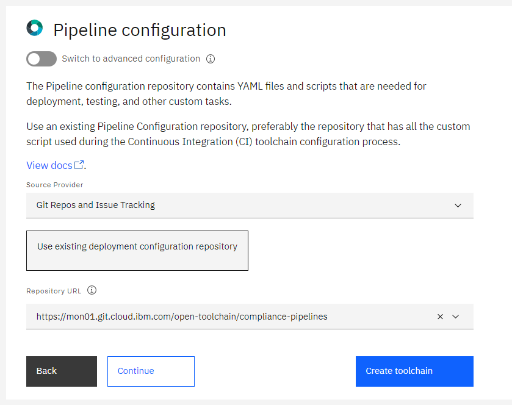
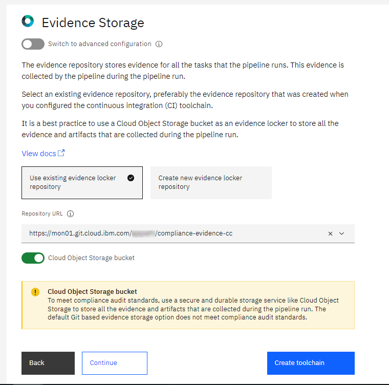
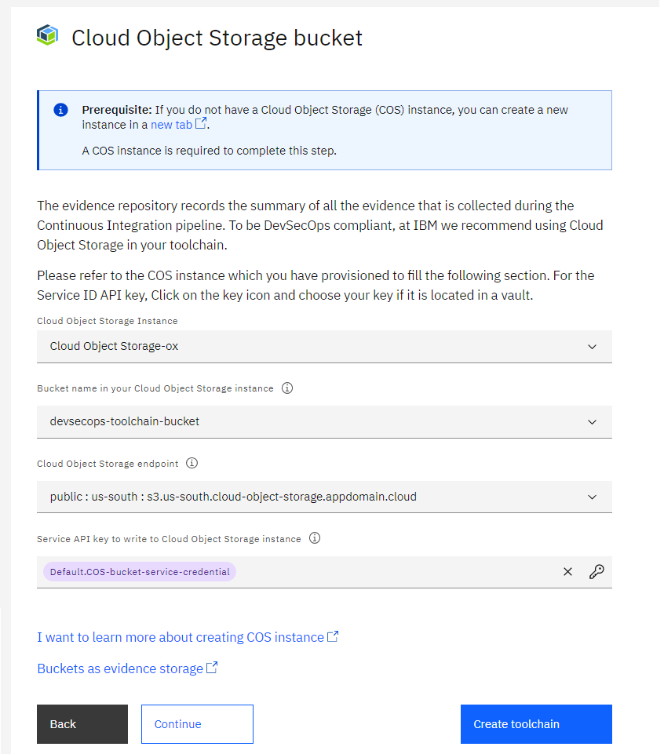
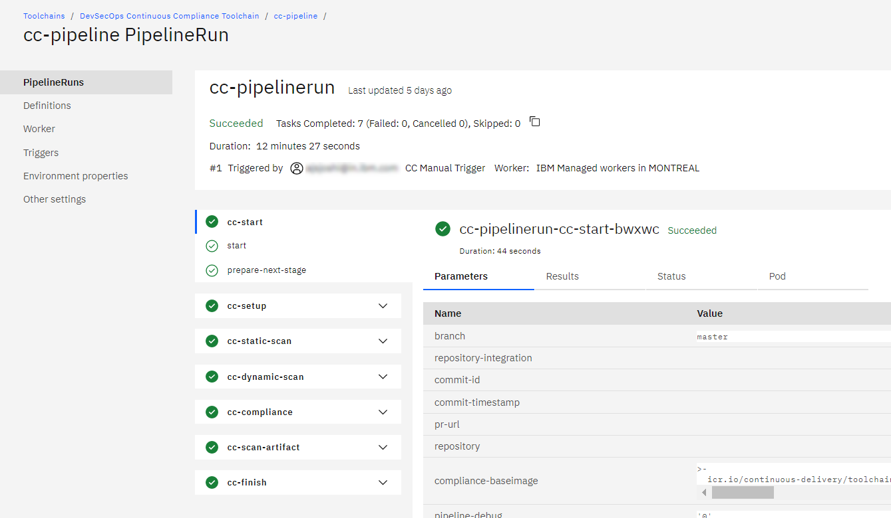

---

copyright:
   years: 2022
lastupdated: "2022-06-01"

keywords: tekton, pipeline, toolchain, CC, automate, automation, continuous delivery, continuous integration, devsecops tutorial, devsecops, continuous compliance, compliance, DevOps, shift-left, shift left, secure DevOps, IBM Cloud, satellite, custom target, multiple clusters

subcollection: devsecops

content-type: tutorial
services: containers, ContinuousDelivery
account-plan: paid
completion-time: 1h

---

{{site.data.keyword.attribute-definition-list}}

# Part 4: Set up a Continuous Compliance (CC) toolchain
{: #tutorial-cc-toolchain}
{: toc-content-type="tutorial"}
{: toc-services="containers, ContinuousDelivery"}
{: toc-completion-time="1h"}

This tutorial is part 4 of a 4-part tutorial series where you learn {{site.data.keyword.cloud}} DevSecOps best practices by using a complete reference implementation that is available as a service and powered by {{site.data.keyword.contdelivery_full}}. In part 4 of this tutorial series, you use the toolchain template for continuous compliance (CC) to ensure that your deployed artifacts and their source repositories are always compliant.
{: shortdesc}

## Before you begin
{: #tutorial-cc-toolchain-prereqs}

Before you begin part 4 of this tutorial series, ensure that you completed the following prerequisites:
1. Complete [Part 1: Set up prerequisites](/docs/devsecops?topic=devsecops-tutorial-cd-devsecops).
1. Complete [Part 2: Set up a Continuous Integration (CI) toolchain](/docs/devsecops?topic=devsecops-tutorial-ci-toolchain).
1. Complete [Part 3: Set up a Continuous Delivery (CD) toolchain](/docs/devsecops?topic=devsecops-tutorial-cd-toolchain).

When you set up the CC toolchain by using the template in this tutorial, you might reuse some or all of the resources that were created during the CI and CD toolchain setup process. The toolchain consists of resources such as {{site.data.keyword.secrets-manager_full}} vault, {{site.data.keyword.containerlong_notm}} cluster, {{site.data.keyword.registrylong}} namespace, {{site.data.keyword.cloud_notm}} API key, {{site.data.keyword.cloud_notm}} CLI, {{site.data.keyword.cos_full_notm}} instance and bucket, {{site.data.keyword.satellitelong_notm}} cluster group and application, and inventory repositories. It helps to keep the resource information from the CI and CD toolchains handy.
{: note}

## Continuous Compliance (CC) toolchain introduction
{: #tutorial-cc-toolchain-intro}

[DevSecOps](#x9892260){: term} integrates a set of security and compliance controls into the [DevOps](https://www.ibm.com/cloud/learn/devops-a-complete-guide){: external} processes. This integration allows organizations to deliver rapidly and often while maintaining a strong security posture and continuous state of audit-readiness. Additionally, DevSecOps makes application and infrastructure security a shared responsibility of development, security, and IT operations teams, rather than the sole responsibility of a security silo.

This tutorial provides information and hands-on guidance on Continuous Compliance reference implementation by using {{site.data.keyword.cloud_notm}} {{site.data.keyword.contdelivery_short}} with Tekton Pipelines. This tutorial steps you through the creation of Continuous Compliance (CC) toolchain by using a toolchain template.

The Continuous [Compliance (CC) pipeline](/docs/devsecops?topic=devsecops-devsecops-cc-pipeline) from this reference implementation can be triggered manually or periodically by using triggers. This pipeline is useful for a continuous scanning of existing deployed artifacts and their source repositories independent of your deployment schedule. It runs the static scans and dynamic scans on the Application Source Code, detect secrets in Git repos, Bill Of Materials (BOM) check, CIS check, and Vulnerability Advisor scan. After scanning and running checks on artifacts and source repositories, the pipeline creates a new incident issue or updates the existing incident issues in the incident repository. Finally, using these issues and the results, the pipeline collects evidence and summarizes the evidence, so the {{site.data.keyword.compliance_short}} Center can update the compliance status of the found artifacts.

The CC pipeline uses the [async sub pipeline](/docs/devsecops?topic=devsecops-devsecops-async-stages#async-stages-setup-triggers) that runs in parallel to the main pipeline run to optimize pipeline run time and improve pipeline resiliency.

This tutorial uses a staging environment as an example to configure and showcase the continuous compliance (CC) toolchain.

{: caption="DevSecOps Continuous Compliance toolchain" caption-side="bottom"}

The CC toolchain implements the following best practices:

* Runs a static code scanner at pre-defined internals on the application repositories that are provided to detect secrets in the application source code and vulnerable packages that are used as application dependencies.
* Scan the container image for security vulnerabilities.
* Any incident issue that is found during the scan or updated is marked with a due date.
* Generate a `summary.json` file and store in IBM Cloud Object Storage at the end of every run that summarizes the details of the scan.

Let's get started with the creation and exploration of the CC toolchain.

## Start the CC toolchain setup
{: #tutorial-cc-toolchain-setup}
{: step}

Start the CC toolchain configuration by using one of the following options:

* Click **Create toolchain**.

   
   
* From the {{site.data.keyword.cloud_notm}} console, click **Menu**  and select **DevOps**. On the Toolchains page, click **Create toolchain**. On the Create a Toolchain page, click **CC - Keep your app continuously Compliant with DevSecOps practices**.

## Set up the CC toolchain name and region
{: #tutorial-cc-toolchain-name-region}
{: step}

The setup starts with a Welcome page that explains the toolchain, prerequisites needed to set this up, useful links like documentation or tutorial, and a framework diagram that explains the correlation between different integrated tools.

{: caption="DevSecOps CC toolchain welcome page" caption-side="bottom"}

Review the default information for the toolchain settings. The toolchain's name identifies it in {{site.data.keyword.cloud_notm}}. Make sure that the toolchain's name is unique within your toolchains for the same region and resource group in {{site.data.keyword.cloud_notm}}.

The toolchain region can differ from cluster and registry region.
{: note}

{: caption="DevSecOps CC toolchain name and region" caption-side="bottom"}

You can provide a CI toolchain already setup at this step. Using filter on the region where your CI toolchain resides helps you to find it easily.

The setup fetches the resource details such as pipeline configuration, repositories like inventory and incidence issues based on the CI toolchain provided. If you chose to not provide any details for the CI toolchain details, you need to manually provide the previously mentioned details in the later steps of the setup.

## Set up CC tool integrations
{: #tutorial-cc-toolchain-tool-integrations}
{: step}

### Secrets
{: #tutorial-cc-toolchain-secrets}

Several tools in this toolchain require secrets to access privileged resources. An {{site.data.keyword.cloud_notm}} API key is an example of such a secret. All secrets must be stored securely in a secrets vault and then referenced as required by the toolchain.

With {{site.data.keyword.cloud_notm}}, you can choose from various secrets management and data protection offerings that help you to protect your sensitive data and centralize your secret. In the Secrets step, you specify which secret vault integrations are added to your toolchain. Use the provided toggles to add or remove the vault integrations that you require as explained in [Managing {{site.data.keyword.cloud_notm}} secrets](/docs/secrets-manager?topic=secrets-manager-manage-secrets-ibm-cloud). This documentation gives you information on prerequisites and how to use a list of prescribed secret names that are otherwise known as hints. By using hints in a template, a toolchain can be automatically populated with preconfigured secrets without any need to manually select them from various vault integrations that are attached to the toolchain.

This tutorial uses IBM Secrets Manager as the vault for secrets. You might want to go with the secret management offering that you used during CI or CD toolchain setup.

{: caption="DevSecOps secrets options" caption-side="bottom"}

Use [IBM Secrets Manager](/docs/secrets-manager?topic=secrets-manager-getting-started) to securely store and apply secrets like API keys, Image Signature, or HashiCorp credentials that are part of your toolchain.

{: caption="DevSecOps IBM Secrets Manager" caption-side="bottom"}

Multiple repositories must be configured during the guided setup, as described in the next sections.

For each repository, provide a URL to an existing IBM-hosted {{site.data.keyword.gitrepos}} repository that you own and that was specified during CI toolchain setup. The toolchain supports linking only to existing {{site.data.keyword.gitrepos}} repositories.
{: note}

### Inventory
{: #tutorial-cc-toolchain-inventory}

The [inventory](/docs/devsecops?topic=devsecops-cd-devsecops-inventory) repository records details of artifacts that are built by the CI toolchains.

{: caption="DevSecOps inventory repository" caption-side="bottom"}

### Target
{: #tutorial-cc-toolchain-target}

Provide details of the target environment to scan the deployed artifacts in this step.
The pipeline runs a number of dynamic scans, and it is recommended to use your staging environment.
IBM Cloud API key: The API key that you created and used during your CI toolchain setup. Optionally you can create a new key and store it in your preferred choice of secrets vault.
Environment tag in your inventory: It is the [tag in your Inventory repository that reflects the state of your current deployed environment. This tag is the snapshot of current running application on target.

{: caption="DevSecOps CC target definition" caption-side="bottom"}

### Issues
{: #tutorial-cc-toolchain-issues}

The {{site.data.keyword.gitrepos}} repository records incident issues that are found while the CC pipeline is running.
{: caption="DevSecOps incident issues repository" caption-side="bottom"}

### Pipeline configuration
{: #tutorial-cc-toolchain-tekton-pipeline}

The toolchain comes with an integrated Tekton pipeline to automate continuous compliance scans of the deployed artifacts and source application repositories. This repository contains Tekton resources that are defined in YAML files that run the pipeline tasks. These repositories can be contributed to or can be forked although it is highly recommended to use the default repository provided by this step.

{: caption="DevSecOps CC Tekton Pipeline configuration" caption-side="bottom"}

### Evidence Storage
{: #tutorial-cc-toolchain-evidence-storage}

All raw compliance evidence that belongs to the application is collected in this repository. This repository option should be used only for evaluation purposes. However, it is recommended to collect and store all the evidences in a Cloud {{site.data.keyword.cos_short}} bucket that can be configured as described in the following image.

{: caption="DevSecOps Evidence Storage" caption-side="bottom"}

### Cloud {{site.data.keyword.cos_short}} bucket
{: #tutorial-cc-toolchain-cos-bucket}

[{{site.data.keyword.cos_full_notm}}](/docs/cloud-object-storage?topic=cloud-object-storage-about-cloud-object-storage) is used to store the evidence and artifacts that are generated by the DevSecOps pipelines. If you want to use this feature, you must have a Cloud {{site.data.keyword.cos_short}} instance and a bucket that is created during your DevSecOps CI toolchain. [Read the recommendation](/docs/devsecops?topic=devsecops-cd-devsecops-cos-config) for configuring a bucket that can act as a compliance evidence locker.

You can optionally set any kind of Cloud {{site.data.keyword.cos_short}} bucket as a locker, even without a retention policy. The pipeline doesn't check or enforce settings at the moment. For help, see the [Cloud {{site.data.keyword.cos_short}} documentation](/docs/cloud-object-storage?topic=cloud-object-storage-getting-started-cloud-object-storage).
{: note}

The following details of the bucket in your resource group and region are fetched and displayed. You must choose the one that is configured with the CI toolchain.
* Cloud {{site.data.keyword.cos_short}} instance 
* Bucket name
* Cloud {{site.data.keyword.cos_short}} endpoint

You need to enter the Service API key to write to Cloud Object Storage instance.

The endpoint field is optional. It is recommended to select or provide the endpoint during the setup of the toolchain or during the pipeline run.
{: note}

{: caption="DevSecOps COS configuration" caption-side="bottom"}

### DevOps Insights
{: #tutorial-cc-toolchain-insights}

[IBM Cloud DevOps Insights](/docs/ContinuousDelivery?topic=ContinuousDelivery-di_working) created during the CI toolchain setup is reused for the CC toolchain and after each compliance check evidence is published into it. You do not need to provide any configuration steps for DevOps Insights. DevOps Insights aggregates code scan, test, build, and deployment data to provide visibility into the velocity and quality of all your teams and releases.
We are working on it to make this available at the earliest!

### SonarQube
{: #tutorial-cc-toolchain-sonarqube}

Configure SonarQube as the static code analysis tool for the toolchain. SonarQube provides an overview of the overall health and quality of your source code and highlights issues that are found in new code. The static code analyzers detect tricky bugs, such as null-pointer dereferences, logic errors, and resource leaks for multiple programming languages.

With **Default Configuration**, the pipeline provisions a new SonarQube instance in the Kubernetes cluster that is configured in the `cc-static-scan` step. A new instance is provisioned during each CC pipeline run.

If you want the toolchain to use an existing SonarQube Instance that you provisioned on another host, use the **Custom Configuration** option.

{: caption="SonarQube static scan configuration" caption-side="bottom"}

### Optional tools
{: #tutorial-cc-toolchain-optional-tools}

#### Slack
{: #tutorial-cc-toolchain-slack}

If you want to receive notifications about your CC Pipeline events, you can configure the [Slack Tool](/docs/ContinuousDelivery?topic=ContinuousDelivery-slack) during the setup from the toolchain template, or you can add the Slack Tool later.

You need a Slack webhook URL so that a Slack channel can receive notifications from your tools. To get a webhook URL, see the Incoming Webhooks section of the [Slack API website](https://api.slack.com/messaging/webhooks){: external}.

#### Delivery Pipeline Private Worker
{: #tutorial-cc-toolchain-private-worker}

The [Delivery Pipeline Private Worker](/docs/ContinuousDelivery?topic=ContinuousDelivery-private-workers) tool integration connects with one or more private workers that can run Delivery Pipeline workloads in isolation.

#### Security and Compliance
{: #tutorial-cd-toolchain-scc}

To integrate the toolchain with {{site.data.keyword.compliance_short}}, you must provide the following information:
* A project name and the evidence locker repository name for the {{site.data.keyword.compliance_short}} data collector.
* The evidence namespace for the type of the toolchain, which is either **Continuous Delivery** or **Continuous Compliance**.

You can also configure the {{site.data.keyword.compliance_short}} integration to trigger a validation after a deployment. For more information about how to choose a profile name, see [Managing security and compliance with Continuous Delivery](/docs/devsecops?topic=devsecops-scc-manage-cd).

Use the {{site.data.keyword.cloud_notm}} Security Best Practices v1.0.0 profile for DevSecOps toolchains.
{: tip}

Learn more about the [Security and Compliance Center](https://cloud.ibm.com/security-compliance/overview){: external}.

## Create the CC toolchain
{: #tutorial-cc-toolchain-summary}
{: step}

On the Summary page, click **Create toolchain**, and wait for the toolchain to be created.

The individual toolchain integrations can be configured also after the pipeline is created.
{: tip}

{: caption="DevSecOps Summary" caption-side="bottom"}

## Explore the CC toolchain
{: #tutorial-cc-toolchain-explore}
{: step}

The created CC toolchain looks like this:

{: caption="DevSecOps Continuous Compliance Toolchain" caption-side="bottom"}

It contains Continuous Compliance pipeline and async pipeline. It comes with three triggers that are built in:
* **CC Manual Trigger**: CC Pipeline can be manually triggered.
* **CC Timed Trigger**: CC Pipeline can be triggered at a pre-determined time. The maximum frequency is at every 5 minutes and can go until once a month. Depending on your requirement CC pipeline can be scheduled run every day, or a particular day of the week at a specified time, and so on.
* **Subpipeline Webhook Trigger**: Async sub pipeline is triggered. You can trigger any stage that is added to the `.pipeline-config.yaml` configuration file by using async sub pipelines. You don't need to add those stages inline to the pipeline, and you don't need to modify the pipeline. For triggering the stage, a webhook trigger is created with a webhook secret. Know more about [Triggering a stage by using async sub pipelines](/docs/devsecops?topic=devsecops-devsecops-async-sub-pipelines).

{: caption="DevSecOps Continuous Compliance pipeline triggers" caption-side="bottom"}

### Update the app URL to run dynamic scan
{: #tutorial-cc-toolchain-app-url}

To run dynamic scan on the target environment, we need to provide application URL to the CC pipeline.

Dynamic scan might run some tests that are intrusive in nature. It is recommended to use a staging environment to run dynamic scan. So, provide the application URL that is running in the staging environment.
{: note}

To get the application URL:
* Go to a successful CI pipeline run
* Go to stage `deploy-dev`
* Click the task `run stage`
* Under `Logs` look for `App URL`

A sample app URL looks like this:
{: caption="Sample application URL from CI Pipeline" caption-side="bottom"}

We need to supply this application URL to the CC pipeline. It can be achieved by:
* Go to the CC pipeline from the newly created CC toolchain tiles
* Click the `Environment Properties`
* Add a new environment variable by using `Add` => `Text value`
* For name of the property mention: `app-url`
* For value, mention the application URL
* Click `Save`

The property after addition looks like this:
{: caption="CC pipeline updated with application URL details" caption-side="bottom"}

Now, you are ready to run the CC pipeline by using a manual trigger.

A completed CC pipeline run looks like this:
{: caption="DevSecOps Continuous Compliance pipeline successful run" caption-side="bottom"}

A completed async sub pipeline run that got triggered during CC pipeline run looks like this:
{: caption="DevSecOps Continuous Compliance async sub pipeline successful run" caption-side="bottom"}

Refer a detailed and updated list of [scans and checks that are run in compliance checks](/docs/devsecops?topic=devsecops-devsecops-cc-pipeline#devsecops-cc-pipeline-compliance-checks).

### Incident issues
{: #tutorial-cc-toolchain-incident-issues}

During CC pipeline execution, incident issues (vulnerability, CVE) are created and attached to the collected evidence. If found in production, these issues can have a specified time period in which they should be fixed so that deployments are not blocked. Thus, the issues are added with a due date. This also helps to continue with the deployment because thought the same issue is found in build, the deployment does not make the security posture worse.

The detailed feature documentation can be found [here](/docs/devsecops?topic=devsecops-devsecops-issues-grace-period).

The issues are created in the issues repository that is mentioned at the time of toolchain setup. A sample issue that indicates a vulnerability with a due date looks like the following:

{: caption="DevSecOps sample incident issue created with CC pipeline" caption-side="bottom"}

### CI and CC pipeline comparison
{: #tutorial-cc-toolchain-comparison}

You might notice that the CI and CC pipeline have many common steps. The scans and checks that are run are similar in nature and details. The pipelines still have some significant differences as explained in the following table:

| CI pipeline | CC pipeline |
|---------|------------|
| It is part of the CI toolchain. | It is part of the CC toolchain. |
| It is triggered after a merge request is merged with the `master` branch | It can be triggered manually or at predefined intervals that are independent of a deployment schedule. |
| An application URL and application code repo details are entered as part of the setup process. | An application URL and application code repo details are provided after the CC toolchain is configured and before initiation of first pipeline run. |
| The incident issues that are created as part of various scans and checks during compliance checks do not carry a due date. | The incident issues that are created as part of various scans and checks during compliance checks carry a due date. |
| The incident issues that are created are found during the build. | The incident issues that are created are found during periodic scans of the staging or production environment. |
| The `summary.json` file is not generated at the end of each CI pipeline run. | The `summary.json` file is not generated at the end of each CI pipeline run. |
| It includes steps like app image creation, image signing, and deploy to dev cluster. This in turn creates inputs for the CD pipeline.  | It runs only scans and checks that are needed for compliance testing. |
{: caption="Table 1. Differences in the CI and CC pipelines" caption-side="bottom"}
