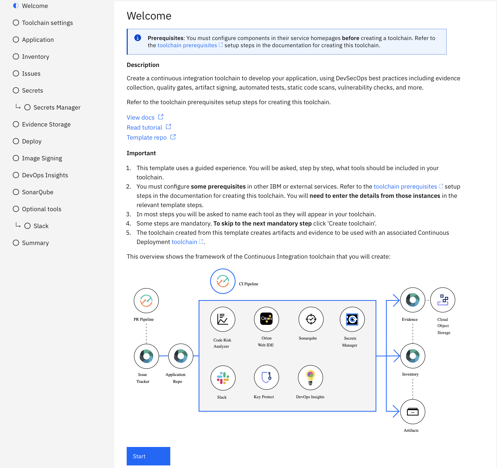
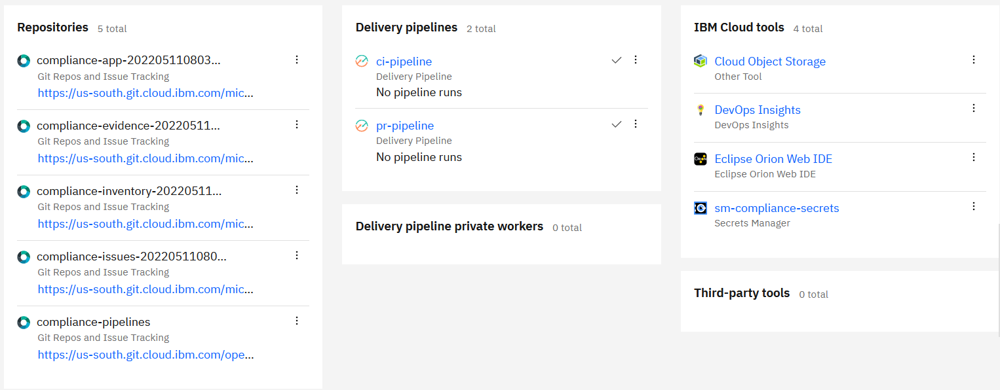
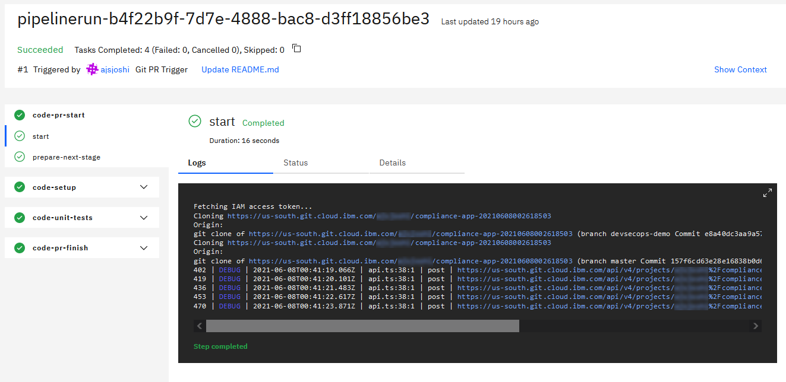
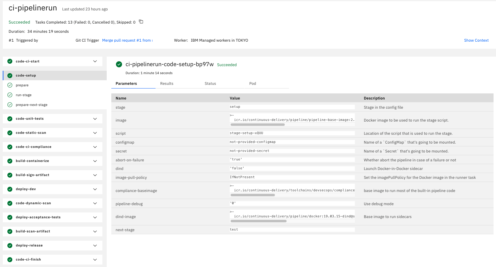
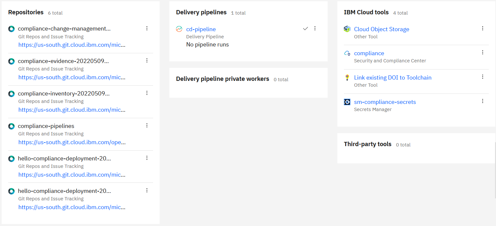
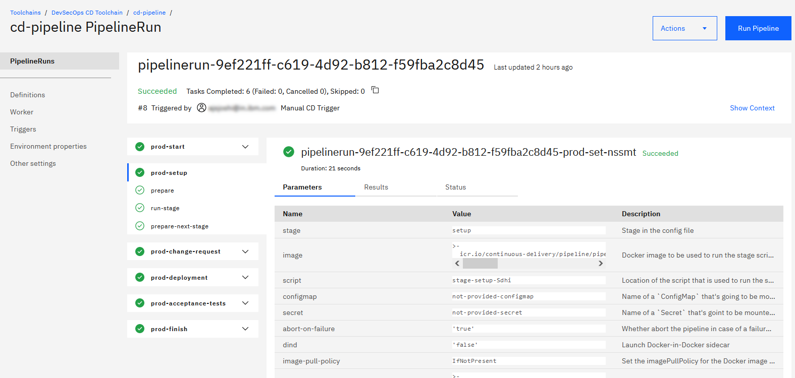

---

copyright:
   years: 2021, 2022
lastupdated: "2022-04-19"

keywords: tekton, pipeline, toolchain, CD, CI, automate, automation, continuous delivery, continuous integration, devsecops tutorial, devsecops, DevOps, shift-left, shift left, secure DevOps, IBM Cloud, satellite, custom target, multiple clusters

subcollection: devsecops

content-type: tutorial
services: apps, containers, ContinuousDelivery
account-plan: paid
completion-time: 2h

---

{{site.data.keyword.attribute-definition-list}}

# Deploy a secure app with DevSecOps best practices
{: #tutorial-cd-devsecops}
{: toc-content-type="tutorial"}
{: toc-services="apps, containers, ContinuousDelivery"}
{: toc-completion-time="2h"}

Use this tutorial to learn how to master DevSecOps best practices by using a complete reference implementation that is available as a service and powered by {{site.data.keyword.contdelivery_full}}.
{: shortdesc}

## Overview
{: #devsecops-tutorial-overview}

Refer to the following documentation to get more information about DevSecOps and its implementation in IBM Cloud Continuous Delivery Service. 
1. [What is DevSecOps](https://www.ibm.com/cloud/learn/devsecops)
1. [DevSecOps architecture](/docs/devsecops?topic=devsecops-cd-devsecops-arch)
1. [DevSecOps with Continuous Delivery](/docs/devsecops?topic=devsecops-devsecops_intro)
1. [Understanding DevSecOps pipelines](/docs/devsecops?topic=devsecops-cd-devsecops-pipelines)

Let's now get started with the creation and exploration of the CI and CD templates in that sequence.

## Before you begin
{: #devsecops-tutorial-prereqs}

To set up the prerequisites for your toolchains, follow these steps:

1. Set up an [{{site.data.keyword.cloud_notm}} account](/registration){: external}. Depending on your {{site.data.keyword.cloud_notm}} account type, access to certain resources might be limited. Depending on your account plan limits, certain capabilities that are required by some DevSecOps toolchains might not be available. For more information, see [Setting up your {{site.data.keyword.cloud_notm}} account](/docs/account?topic=account-account-getting-started) and [Upgrading your account](/docs/account?topic=account-upgrading-account).
1. Ensure that all of the secret values that you need are stored in a secrets management vault. [Managing {{site.data.keyword.cloud_notm}} secrets](/docs/secrets-manager?topic=secrets-manager-manage-secrets-ibm-cloud) can help you to choose from various secrets management and data protection offerings. If you don't already have an instance of the secrets management vault provider of your choice, create one.
1. Create a [Kubernetes cluster](/kubernetes/catalog/cluster/create){: external}. While you are evaluating the service, you can use the **Free** pricing plan. The cluster might take some time to provision. As the cluster is created, it progresses through these stages: Deploying, Pending, and Ready. [Learn more.](/docs/containers?topic=containers-clusters).
1. Create an [{{site.data.keyword.registrylong}} namespace](https://cloud.ibm.com/registry/namespaces){: external}. {{site.data.keyword.registrylong_notm}} provides a multi-tenant private image registry that you can use to store and share your container images with users in your {{site.data.keyword.cloud_notm}} account. Select the location for your namespace, and click **Create**. [Learn more.](/docs/Registry?topic=Registry-getting-started)
1. **Optional.** Create an [image signing key](/docs/devsecops?topic=devsecops-devsecops-image-signing) with the proper encoding to sign your application docker images.
1. **Optional.** Create an [{{site.data.keyword.cloud_notm}} API key](https://cloud.ibm.com/iam/apikeys){: external}. Save the API key value by either copying, downloading it or adding it to your vault. Alternatively, you can create the API key during the template guided setup process.
1. **Optional.** Validate that the [recommended IAM permissions](/docs/devsecops?topic=devsecops-cd-devsecops-iam-permissions) are assigned to corresponding integrations.
1. **Optional.** [Install the {{site.data.keyword.cloud_notm}} CLI](/docs/cli?topic=cloud-cli-getting-started).
1. **Optional.** Create an [{{site.data.keyword.cos_full_notm}} instance and bucket](/docs/devsecops?topic=devsecops-cd-devsecops-cos-config). [Learn more.](/docs/cloud-object-storage?topic=cloud-object-storage-about-cloud-object-storage)
1. **Optional.** Create an [{{site.data.keyword.satellitelong_notm}} cluster group](/docs/satellite?topic=satellite-setup-clusters-satconfig) if you want to deploy your application to multiple clusters that are grouped as a {{site.data.keyword.satelliteshort}} cluster group by using {{site.data.keyword.satelliteshort}} Config. [Learn more.](/docs/satellite?topic=satellite-cluster-config)

If you want to automatically set up the DevSecOps infrastructure for your toolchains by using an [{{site.data.keyword.bplong}} workspace](/docs/schematics?topic=schematics-about-schematics) and a Terraform-based quick start template, skip the previous steps and go to [Set up your DevSecOps infrastructure and CI toolchain for deploying a secure app](/docs/apps?topic=apps-tutorial-apps-devsecops). After the prerequisites and CI toolchain are successfully configured, proceed to the [Continuous Delivery (CD) toolchain introduction](#devsecops-cd-toolchain-intro).
{: tip}

## Continuous Integration (CI) toolchain introduction
{: #devsecops-ci-toolchain-intro}

The CI toolchain implements the following best practices:

* Runs a static code scanner on the application repositories to detect secrets in the application source code and vulnerable packages that are used as application dependencies
* Builds a container image on every Git commit, setting a tag based on build number, timestamp, and commit ID for traceability
* Tests the Dockerfile before the image is created
* Stores the built image in a private image registry
* Automatically configures access permissions for target cluster deployment by using API tokens that can be revoked
* Scans the container image for security vulnerabilities
* Adds a Docker signature upon successful completion
* Inserts the built image tag into the deployment manifest automatically
* Uses an explicit namespace, in cluster, to insulate each deployment (and make it easy to clear, by `kubectl delete namespace`)
* Automatically builds, validates, and deploys to the Kubernetes cluster any code merged into the target Git repository branch.

The target cluster is configured during toolchain setup (by using an {{site.data.keyword.cloud_notm}} API key and cluster name). You can later change these settings by altering the Delivery Pipeline configuration.

{: caption="DevSecOps Continuous Integration toolchain" caption-side="bottom"}

## Guided setup overview for the CI toolchain
{: #devsecops-ci-toolchain-guided-setup}

The Continuous Delivery service provides templates that guide you through the toolchain setup process in a logical order, presenting you with the recommended configuration options that are needed to create your toolchain.

A progress indicator shows the steps to complete the configuration. You can use the progress indicator to navigate to a previous step with a mouse click. The configuration options for the current step are displayed in the main area of the page.

{: caption="DevSecOps Continuous Integration toolchain welcome page" caption-side="bottom"}

To advance to the next step, click **Continue**. You can advance to the next step only when the configuration for the current step is complete and valid. You can navigate to the previous step by clicking **Back**.

Some steps include a **Switch to advanced configuration** toggle. These steps by default present you with the minimum recommended configuration needed. However, advanced users that need finer grained control can click the **Switch to advanced configuration** toggle to reveal all options for the underlying integration.

{: caption="DevSecOps Advanced configuration toggle" caption-side="bottom"}

After all the steps are successfully completed, you create the toolchain by clicking **Create** on the Summary step.

You can always go back to previous steps in the guided installer. The toolchain installer retains all the configuration settings from the successive steps.
{: tip}

## Start the CI toolchain setup
{: #devsecops-ci-toolchain-create-options}
{: step}

Use one of the following options to access the template for the CI toolchain:

* Click **Create toolchain**.

   {: external}

* From the [{{site.data.keyword.cloud_notm}} console](https://cloud.ibm.com/), click **Menu**  and select **DevOps**. On the Toolchains page, click **Create toolchain**. On the Create a Toolchain page, click **CI - Develop a secure app with DevSecOps practices**.

## Set up the CI toolchain name and region
{: #devsecops-ci-toolchain-name-region}
{: step}

The **Welcome** page you are taken to provides a summary of the purpose of the toolchain that is created, along with pointers to documentation and related materials. When you are ready to proceed, click the **Start** button to begin configuring the toolchain.

Review the default information for the toolchain settings:
1. The toolchain's name identifies it in {{site.data.keyword.cloud_notm}}. Make sure that the toolchain's name is unique within your toolchains for the same region and resource group in {{site.data.keyword.cloud_notm}}.
1. The toolchain region is the region where the toolchain itself and related resources (Git repos, pipelines, and so on) are created. Toolchains can deploy to any region, regardless of where they are created.

## Set up CI tool integrations
{: #devsecops-ci-tool-integrations}
{: step}

Multiple repositories must be configured during the guided setup, as described in the following sections.

For each repository, you can either clone the repository that is provided as a sample. Alternatively, you can provide a URL to an existing IBM-hosted Git Repos and Issue Tracking (GRIT) repository that you own. The toolchain supports linking only to existing GRIT repositories.
{: note}

### Application
{: #devsecops-ci-tool-integration-application}

The application source code repository can be hosted either on GitHub or the IBM-hosted Git Repos and Issue Tracking (GRIT) repository from the list of source providers. For consistency, this tutorial refers to GRIT.
{: note}

The recommended options are displayed by default, but you can click the **Switch to advanced configuration** toggle to see all of the configuration options available for the underlying Git integration. The default behavior of the toolchain is `Use default sample` that clones the sample application into an IBM-hosted GRIT Repository.

Enter a name for the IBM-hosted GRIT repository that is created by the toolchain as your application repository.

The region of the repository remains the same as the region of the toolchain.

If you want to link an existing Application Repository for the toolchain, select the `Bring your own app` option, and provide it as input to `Repository URL` field. As noted earlier, the toolchain currently supports linking only to existing GRIT repositories. If you want to know more about `Bring your own app`, see [Bringing your own app to DevSecOps](/docs/devsecops?topic=devsecops-cd-devsecops-apps-byoa).

### Inventory
{: #devsecops-ci-tool-integration-inventory}

The inventory repository records details of artifacts that are built by the CI toolchains.

### Issues
{: #devsecops-ci-tool-integration-issues}

The issues repository records issues that are found while the CI pipeline is running.

### Secrets
{: #devsecops-ci-tool-integration-secrets}

Specify the secret vault integrations to be added to your toolchain by using the provided toggles, as explained in [Managing {{site.data.keyword.cloud_notm}} secrets](/docs/secrets-manager?topic=secrets-manager-manage-secrets-ibm-cloud).

This tutorial uses IBM Secrets Manager as the vault for secrets. The **Region**, **Resource group**, and **Service name** fields are automatically populated based on available choices. Click the drop-down indicators to see the other choices.

If you plan to use IBM Key Protect or HashiCorp vault for managing your secrets, see the [IBM Key Protect section of the CI setup guide](/docs/devsecops?topic=devsecops-cd-devsecops-tekton-ci-compliance#cd-devsecops-key-protect-ci).

### Evidence Storage
{: #devsecops-ci-tool-integration-evidence-storage}

The evidence repository stores all the evidence and artifacts that are generated by the DevSecOps CI pipeline.

Toggle the COS bucket slider to also store all the evidences in a Cloud {{site.data.keyword.cos_short}} bucket that can be configured on the next page.

### Cloud {{site.data.keyword.cos_short}} bucket
{: #devsecops-ci-tool-integration-cos-bucket}

To use this feature, you must have a Cloud {{site.data.keyword.cos_short}} instance and a bucket. [Click here](/docs/devsecops?topic=devsecops-cd-devsecops-cos-bucket-evidence) to create a Cloud {{site.data.keyword.cos_short}} instance, and [read the recommendation](/docs/devsecops?topic=devsecops-cd-devsecops-cos-config) for configuring a bucket that can act as a compliance evidence locker.
{: note}

* **Cloud {{site.data.keyword.cos_short}} instance**, **Bucket name**, and **Cloud {{site.data.keyword.cos_short}} endpoint** fields are automatically populated.
* Enter the Service ID API key
   * Preferred: An existing key can be imported from a secrets vault by clicking the key icon.
   * An existing key can be copy and pasted.

The endpoint field is optional. It is recommended to select or provide the endpoint during the setup of the toolchain or during the pipeline run.
{: note}

### Deploy
{: #devsecops-ci-tool-integration-deploy}

Configure the target Kubernetes cluster where the application is deployed:

* **App name:**
   The name of the application.
   * Default: hello-compliance-app

* **{{site.data.keyword.cloud_notm}} API Key:**
   The API key is used to interact with the ibmcloud CLI tool in several tasks.
   * Preferred: An existing key can be imported from a secrets vault by clicking the key icon.
   * An existing key can be copy and pasted.
   * A new key can be created from here by clicking the **New +**.

The newly generated API key can be immediately saved to a secrets vault.
{: tip}

If the API key is valid and has sufficient access, the Container registry region and namespace Cluster region, name, namespace, and resource group are automatically populated. You can change any of these fields to match your configuration if needed.

### Image Signing
{: #devsecops-ci-tool-integration-image-signing}

Any images that are built by this toolchain and recorded in the inventory must be signed before they can be deployed to production.

To enable image signing, you need to provide a GPG key. You can select an existing key from a secret store or input the value directly. Alternatively you can create a new GPG key by clicking **NEW**.

Ensure that the key follows the appropriate encoding as required by the chosen tool to store secrets.
{: note}

### DevOps Insights
{: #devsecops-ci-tool-integration-insights}

[IBM Cloud DevOps Insights](/docs/ContinuousDelivery?topic=ContinuousDelivery-di_working) is included in the created toolchain. View your pipeline test results for every build, from every deployment and environment. 

You do not need to provide any configuration steps for DevOps Insights (DOI). Select a DOI instance for your toolchain:

* Current (to be created) CI toolchain
* Another toolchain instance: select an existing toolchain (that has a DOI instance)

### SonarQube
{: #devsecops-ci-tool-integration-sonarqube}

SonarQube provides an overview of the overall health and quality of your source code and highlights issues that are found in new code. The static code analyzers detect tricky bugs, such as null-pointer dereferences, logic errors, and resource leaks for multiple programming languages.

Default configuration
:   Run a SonarQube scan in an isolated Docker-in-Docker container without persisting the SonarQube instance.

Cluster configuration
:   A new SonarQube instance is provisioned in the Kubernetes cluster (chosen at the Deploy step) during the first CI pipeline run.

Custom configuration
:   Link an existing SonarQube instance with the toolchain.

### Optional tools
{: #devsecops-ci-tool-integration-optional-tools}

#### Slack
{: #devsecops-ci-tool-integration-optional-slack}

Configure the [Slack Tool](/docs/ContinuousDelivery?topic=ContinuousDelivery-slack) to receive notifications about your PR/CI Pipeline events.
* [Slack webhook](https://api.slack.com/incoming-webhooks)
* Preferred: An existing webhook can be imported from a secrets vault by clicking the key icon.
* An existing webhook can be copy and pasted.
* Slack channel: an existing Slack channel to post message to
* Slack team name: the phrase before *.slack.com* in our team URL. For example, if your team URL https://team.slack.com, the team name is *team*.
* Automated Slack Notifications: Customize your selection by choosing the events for which you want to receive notifications.

You can add the Slack Tool after toolchain creation.
{: note}

#### Orion WebIDE
{: #devsecops-ci-tool-integration-optional-webide}

The Eclipse [Orion Web IDE](/docs/ContinuousDelivery?topic=ContinuousDelivery-web_ide) is a browser-based development environment where you can develop for the web in JavaScript, HTML, and CSS with the help of content assist, code completion, and error checking.

No configuration required.

## Create the CI toolchain
{: #devsecops-ci-toolchain-summary}
{: step}

On the Summary page, click the **Create** button, and wait for the toolchain to be created.

Other toolchain integrations can be configured after the pipeline is created.
{: tip}

## Explore the CI toolchain
{: #devsecops-ci-toolchain-explore}
{: step}

The DevSecOps CI toolchain looks like this:

{: caption="DevSecOps Continuous Integration Toolchain" caption-side="bottom"}

It contains two pipelines:
* **ci-pr-pipeline (PR)**: triggers when a new Merge Request (MR) is submitted in the app repository.
* **ci-pipeline (CI)**: triggers when an MR is merged to master in the app repository, but can be manually triggered.

### Run the ci-pr Pipeline
{: #devsecops-ci-toolchain-pr-pipeline-run}

To start the ci-pr pipeline, you need to create a merge request in your application repository.
1. From the CI toolchain page, click the application repository tile. By default it gets created with a name `compliance-app-<timestamp>`.
1. Create a branch from master branch.
1. Update some code like in app or readme file and save changes.
1. Submit merge request.
1. On the CI toolchain page, click the `pr-pipeline` tile. Verify that the ci-pr pipeline is triggered (by the creation of the Merge Request).
1. Wait for the ci-pr pipeline run to complete.

The corresponding Merge Request that is in your application repository is in `Pending` state until all the stages of PR Pipeline finish successfully.

After the PR Pipeline run is successful, you can click it to explore numerous steps completed.

{: caption="DevSecOps PR Pipeline Successful" caption-side="bottom"}

1. Navigate back to the merge request.
1. Merge the request so that your changes are copied to the master branch of your application repository: the CI pipeline is automatically triggered.

### Run the CI pipeline
{: #devsecops-ci-toolchain-ci-pipeline-run}

Start the CI pipeline in one of the following ways:
* Automatically: after a successful PR pipeline, by approving and merging the PR to the master branch.
* Manually: to trigger the CI pipeline manually, select the Delivery Pipeline card and click **Run Pipeline** and select `Manual Trigger`.

In this tutorial, the CI Pipeline was triggered after you merged your code changes to the master branch of your application repository.
1. On the CI toolchain page, click the `ci-pipeline` tile.
1. Observe: a pipeline-run is running. Wait for the pipeline-run to complete.

After the CI Pipeline run is successful, you can click it to explore the completed steps.

{: caption="DevSecOps CI pipeline" caption-side="bottom"}

Evidence from all compliance checks in the CI pipeline is uploaded to the evidence-locker repository, but also to the COS bucket if enabled during setup.
Evidence is also published to DevOps Insights. You can navigate to DOI by clicking the DevOps Insights tool card in the toolchain. You can review the collected evidence on the Quality Dashboard page.

{: caption="DevSecOps CI evidence" caption-side="bottom"}

To evaluate if you have any failures in your pipeline run, you need to check the final step of your pipeline, which has a pipeline evaluator.
{: note}

### Viewing the running application
{: #devsecops-ci-toolchain-view-app}

After a successful CI pipeline run, the sample application is deployed on your Kubernetes cluster.

The app url can be found at the end of the log of the `run stage` step of `deploy-dev` task of the CI Pipeline run. Use that url to verify that the app is running.

### Pipeline customization
{: #devsecops-ci-toolchain-pipeline-config}

Custom scripts are extension points in the pipeline where adopters, teams, and users can provide scripts to run custom tasks that are required by their continuous integration and continuous delivery strategies.

Custom scripts control the pipeline stages. You can use a configuration file (`pipeline-config.yaml`) to configure the behavior of stages, script content, and the base image that runs the scripts. The scripts and configuration for pipeline stages are loaded from a Git repository (repo) that can either be the application (app) repo (similar to `.travis.yml` or `Jenkinsfile`) or a custom repo.

More detailed information on customizing the CI pipelines can be found [here](/docs/devsecops?topic=devsecops-custom-scripts). 

### Wrapping up
{: #devsecops-ci-toolchain-done}

By completing the CI part of this tutorial, you:
* Created a DevSecOps CI toolchain
* Modified some code in the application repository
* Ran the ci-pr pipeline before you merge your changes
* Ran the ci-pipeline to build, test, and deploy your changes to your dev environment.

Let's proceed with Continuous Delivery (CD) toolchain now.

## Continuous Delivery (CD) toolchain introduction
{: #devsecops-cd-toolchain-intro}

### CD - Deploy a secure app with DevSecOps practices
{: #devsecops-cd-toolchain-tekton-pipeline}

This is the toolchain template for continuous deployment with security and compliance-related best practices in DevSecOps. It is preconfigured for Continuous Delivery with inventory integration, change management with GRIT, evidence collection, and deployment to the IBM Kubernetes Service.

The DevSecOps CD toolchain contains only one pipeline for Continuous Delivery. It implements the following best practices:

* Change Management automation to help developers, approvers, and auditors track deployments from the lens of compliance.
* Creates an evidence summary from the evidence that is collected in the CI pipeline
* Creates a change request in Git Repos and Issue Tracking based change management repository and adds deployment evidence to it
* Uses the inventory repository to promote built artifacts to deployment environments like staging and prod
* Checks the CR, and auto approves if all checks have passed
* If CR is approved, or emergency, deploys the image from the inventory to production

{: caption="DevSecOps CD deployment" caption-side="bottom"}

## Guided setup overview for the CD toolchain
{: #devsecops-cd-toolchain-guided-setup}

Any of the methods in this tutorial takes you to the guided setup experience. You are guided through the toolchain setup process in a logical order, and you are presented with the recommended configuration options that are needed to create your toolchain.

A progress indicator shows the steps to complete the configuration. You can use the progress indicator to navigate to a previous step with a mouse click. The configuration options for the current step are displayed in the main area of the page.

{: caption="DevSecOps Continuous Delivery toolchain welcome page" caption-side="bottom"}

To advance to the next step, click **Continue**. You can advance to the next step only when the configuration for the current step is complete and valid. You can navigate to the previous step by clicking **Back**.

Some steps include a **Switch to advanced configuration** toggle. These steps by default present you with the minimum recommended configuration needed. However, advanced users that need finer grained control can click the **Switch to advanced configuration** toggle to reveal all options for the underlying integration.

{: caption="DevSecOps Advanced configuration toggle" caption-side="bottom"}

After all the steps are successfully completed, you create the toolchain by clicking **Create** on the Summary step.

You can always go back to previous steps in the guided installer. The toolchain installer retains all the configuration settings from the successive steps.
{: tip}

## Start the CD toolchain setup
{: #devsecops-cd-toolchain-create-options}
{: step}

Start the CD toolchain configuration by using one of the following options:

* Click the following **Create toolchain** button.

   {: external}

* From the {{site.data.keyword.cloud_notm}} console, click **Menu**  and select **DevOps**. On the Toolchains page, click **Create toolchain**. On the Create a Toolchain page, click **CD-Develop with DevSecOps practices**.

## Set up the CD toolchain name and region
{: #devsecops-cd-toolchain-name-region}
{: step}

Review the default information for the toolchain settings. The toolchain's name identifies it in {{site.data.keyword.cloud_notm}}. Make sure that the toolchain's name is unique within your toolchains for the same region and resource group in {{site.data.keyword.cloud_notm}}.

The toolchain region can differ from cluster and registry region. 
{: note}

You can optionally choose the associated CI toolchain in the dropdown. This copies some of the CI configuration to aid in the setup of this CD toolchain.

**Warning**: This might overwrite values that you have already input.

## Set up CD tool integrations
{: #devsecops-cd-tool-integrations}
{: step}

If you already linked to an existing CI toolchain in the Welcome step, the names of application-related repositories that are used in that toolchain are prefilled. Review the repository URLs, and then continue to the next steps.
{: tip}

### Application-related repositories
{: #devsecops-cd-tool-integration-application}

If you want to set up your CD toolchain from scratch, configure these repositories during CI toolchain creation, and then use or link to them here.

To fetch the respective URL, go to the CI Pipeline, select the respective tool card. Right-click the tool card, select `Copy link address`.

* **Inventory**: The inventory repository records details of artifacts that are built by the CI and CD pipelines. For example, `https://<region>.git.cloud.ibm.com/myorg/my-compliance-ci-inventory`
* **Issues**: The issues repository records issues that are found while the CI pipeline is running. For example, `https://<region>.git.cloud.ibm.com/myorg/my-compliance-ci-issues`.
* **Evidence**: All raw compliance evidence that belongs to the application is collected here. For example, `https://<region>.git.cloud.ibm.com/myorg/my-compliance-ci-evidence`.

The toolchain currently supports linking only to existing IBM-hosted Git Repos and Issue Tracking (GRIT) repositories.
{: note}

### Inventory
{: #devsecops-cd-tool-integration-inventory}

**Repository URL**: URL of the Inventory Repository configured in your CI Toolchain as captured in the previous step.

### Issues
{: #devsecops-cd-tool-integration-issues}

**Repository URL**: URL of the Issues Repository configured in your CI Toolchain as captured in the previous step.

### Pipeline Configuration
{: #devsecops-cd-tool-integration-pipeline-config}

The Pipeline configuration repository contains YAML files and scripts that are needed for deployment, testing, and other custom tasks.

If you do not have a configuration repository, enable the **Advanced configuration** toggle, and select the **Clone repository** type. The toolchain clones the [sample configuration](https://us-south.git.cloud.ibm.com/open-toolchain/hello-compliance-deployment) in your Git organization.

For more information about Git Repos, see the CD toolchain setup [documentation](docs/ContinuousDelivery?topic=ContinuousDelivery-cd-devsecops-tekton-cd-compliance). For more information about customizable scripts, see the custom script [documentation](docs/ContinuousDelivery?topic=ContinuousDelivery-cd-devsecops-custom-scripts).

### Secrets
{: #devsecops-cd-tool-integration-secrets}

Several tools in this toolchain, and possibly in your customizable scripts, require secrets to access privileged resources. An IBM Cloud API key is an example of such a secret. These secrets must be securely stored within an IBM-recommended secrets management tool, such as [IBM Key Protect for IBM Cloud](https://www.ibm.com/cloud/key-protect), [IBM Cloud Secrets Manager](https://www.ibm.com/cloud/secrets-manager), or [Hashicorp Vault](https://www.vaultproject.io/). The secrets management tool can be integrated into the toolchain so that you can easily reference the secrets in your Tekton pipeline.

This tutorial uses IBM Secrets Manager as the vault for secrets.

If you plan to use IBM Key Protect or HashiCorp Vault for managing your secrets, refer to details in the [CD Toolchain Setup Guide](/docs/devsecops?topic=devsecops-cd-devsecops-tekton-cd-compliance#ibm-key-protect)

### Evidence Storage
{: #devsecops-cd-tool-integration-evidence-storage}

The evidence repository stores evidence for all the tasks that the pipeline runs. This evidence is collected by the pipeline during the pipeline run.

Select an existing evidence repository, preferably the evidence repository that was created when you configured the continuous integration (CI) toolchain.

It is a best practice to use a Cloud Object Storage bucket as an evidence locker to store all the evidence and artifacts that are collected during the pipeline run.

For more information about Evidence Storage, see the [documentation](docs/ContinuousDelivery?topic=ContinuousDelivery-cd-devsecops-evidence).

### Evidence
{: #devsecops-cd-tool-integration-evidence}

**Repository URL**: URL of the Evidence Locker Repository configured in your CI Toolchain as captured in the previous step.

### Cloud {{site.data.keyword.cos_short}} bucket
{: #devsecops-cd-tool-integration-cos-bucket}

To use this feature, you must have a Cloud {{site.data.keyword.cos_short}} instance and a bucket. [Click here](/docs/devsecops?topic=devsecops-cd-devsecops-cos-bucket-evidence) to create a Cloud {{site.data.keyword.cos_short}} instance, and [read the recommendation](/docs/devsecops?topic=devsecops-cd-devsecops-cos-config) for configuring a bucket that can act as a compliance evidence locker.
{: note}

* Cloud {{site.data.keyword.cos_short}} instance, Bucket name, and Cloud {{site.data.keyword.cos_short}} endpoint fields are automatically populated.
* Enter the Service ID API key
   * Preferred: An existing key can be imported from a secrets vault by clicking the key icon.
   * An existing key can be copy and pasted.

The endpoint field is optional. It is recommended to select or provide the endpoint during the setup of the toolchain or during the pipeline run.
{: note}

### Deployment target
{: #devsecops-cd-tool-integration-deploy}

Configure the target where the application is deployed. The toolchain provides with an option to either deploy your application to **Single cluster** or to **Multiple clusters** by using {{site.data.keyword.satelliteshort}} Config. If you want to deploy your application to targets like VSI (Virtual Server Instance) or customize deployment process, use the **Custom** option. 

### IBM Cloud API Key
{: #devsecops-cd-tool-integration-api-key}

The API key is used to interact with the ibmcloud CLI tool in several tasks.
* Preferred: An existing key can be imported from a secrets vault by clicking the key icon.
* An existing key can be copy and pasted.
* A new key can be created from here by clicking the **New +**.

The newly generated API key can be immediately saved to a secrets vault.
{: tip}

### Single cluster deployment target
{: #devsecops-single-cluster-target}

With this option, you can deploy your application to an existing Kubernetes cluster on {{site.data.keyword.cloud_notm}}. The toolchain currently supports Kubernetes cluster that is managed by {{site.data.keyword.containerlong_notm}} or a Red Hat OpenShift cluster. After the {{site.data.keyword.cloud_notm}} API Key field is completed, select the **Resource group** and **Cluster region** field where your target cluster is created. Select the target **Cluster name** after you choose the appropriate value for the resource group and cluster region fields.

Provide the name of **Cluster namespace** where you want to deploy your application. If the namespace exists, your application is deployed in that namespace, else toolchain creates a new namespace with the name during the first deployment of the application.

### Multiple clusters deployment target
{: #devsecops-multiple-clusters-target}

With this option, you can deploy your application to a group of {{site.data.keyword.containerlong_notm}} clusters or Red Hat OpenShift clusters on {{site.data.keyword.cloud_notm}}.

The toolchain uses [Satellite Config](/docs/satellite?topic=satellite-cluster-config) to group multiple clusters in a cluster group and simultaneously deploy the application to all the clusters. [Learn more](/docs/satellite?topic=satellite-setup-clusters-satconfig#setup-clusters-satconfig-groups) about setting up cluster groups for multiple clusters. 

After your cluster group is set up, provide the name of **Cluster namespace** where you want to deploy your application. If the namespace exists, your application is deployed in that namespace. Otherwise, elthese toolchain creates a new namespace with the name during the first deployment of the application.

### Custom target
{: #devsecops-custom-target}

With this option, you can customize the deployment step to deploy your application to any target other than a Kubernetes cluster (for example, Virtual Server Instances (VSI)). This option requires you to provide the {{site.data.keyword.cloud_notm}} API key that can later be used within deployment scripts within the pipeline to access various cloud resources.

### Change request management
{: #devsecops-cd-tool-integration-change-request}

{{site.data.keyword.cloud_notm}}-hosted GRIT (Git Repos and Issue Tracking) repository to [manage change requests](docs/devsecops?topic=devsecops-cd-devsecops-change-mgmt).

### DevOps Insights toolchain
{: #devsecops-cd-tool-integration-insights}

Link an existing DevOps Insights instance from another toolchain to this pipeline, so that all the build, deploy, and test records from the CI and CD toolchain pipelines can be collected in the same place.

The CD toolchain can publish the deployment records to an existing DevOps Insights instance. To enable this feature, provide the ID of the toolchain that contains the existing DevOps Insights instance by selecting it in the DevOps Insights toolchain ID drop-down.

### Optional Tools
{: #devsecops-cd-tool-integration-optional-tools}

#### Slack
{: #devsecops-cd-tool-integration-slack}

Configure the [Slack Tool](/docs/ContinuousDelivery?topic=ContinuousDelivery-slack) to receive notifications about your PR/CI Pipeline events.
* [Slack webhook](https://api.slack.com/incoming-webhooks)
* Preferred: An existing webhook can be imported from a secrets vault by clicking the key icon.
* An existing webhook can be copy and pasted.
* Slack channel: an existing Slack channel to post message to
* Slack team name: the phrase before *.slack.com* in our team URL. For example, if your team URL https://team.slack.com, the team name is *team*.
* Automated Slack Notifications: Customize your selection by choosing the events for which you want to receive notifications.

You can add the Slack Tool after toolchain creation.
{: note}

After you create your toolchain, you can toggle sending notifications with the `slack-notifications` Environment Property in your CD Pipeline (0 = off, 1 = on)

#### Security and Compliance
{: #devsecops-cd-tool-integration-scc}

To integrate the toolchain with the Security and Compliance Service, you need to provide a project name and the evidence locker repository name for the Security and Compliance data collector.

You can also configure the Security and Compliance integration to trigger a validation after a deployment. For more information about how to choose a profile name, see [Managing security and compliance with Continuous Delivery](/docs/ContinuousDelivery?topic=ContinuousDelivery-cd-manage-security-compliance).

Learn more about the [Security and Compliance Center](https://cloud.ibm.com/security-compliance/overview){: external}.

## Create the CD toolchain
{: #devsecops-cd-toolchain-summary}
{: step}

On the Summary page, click **Create**, and wait for the toolchain to be created.

The individual toolchain integrations can be configured also after the pipeline is created.
{: tip}

{: caption="DevSecOps CD Toolchain Created" caption-side="bottom"}

## Explore the CD toolchain
{: #devsecops-cd-toolchain-explore}
{: step}

Now that the CD Toolchain is created, click the `cd-pipeline card` to open and run the Promotion Pipeline.

### Run the Promotion Pipeline
{: #devsecops-cd-toolchain-promotion-pipeline-run}

Make sure that the [CI Pipeline](docs/devsecops?topic=devsecops-cd-devsecops-ci-pipeline) ran successfully before you run the Promotion Pipeline.
{: note}

The Promotion Pipeline creates a Pull Request with the content of the inventory on the Inventory Source Environment (for example: master) branch targeting the Inventory Target Environment branch (for example: staging or prod). 

* On the `cd-pipeline Dashboard`, click **Run pipeline**, and select the `Manual Promotion Trigger`. Click `Run` to trigger the pipeline. 
* Wait for the Promotion Pipeline run to complete and check execution log.
* After the `Promotion Pipeline` finishes successfully, the `promote` Task log provides a link to the `Pull Request` in the Inventory Repository. The pull request name is of the format `promote <Inventory Source Environment> to <Inventory Target Environment>`.

1. Open the `Pull Request` in your browser with the link provided in the log. Complete the details in the following sections:
   * **Priority**: (mandatory) One of Critical, High, Moderate, Low, Planning
   * **Change Request assignee**: (mandatory) email-id of the assignee
   * **Additional Description**: Description about the changes in the application
   * **Purpose**: Purpose of the changes that are made to the application
   * **Explanation of Impact**: Impact of the change to the application behavior or environment
   * **Backout Plan**: Steps to back out if there is a deployment failure
1. Complete the fields in the `Pull Request` and `save`.
1. Add the `EMERGENCY` label to your PR if any compliance checks in CI failed and you want to [continue with deployment](docs/devsecops?topic=devsecops-cd-devsecops-approve-cr#cd-devsecops-emergency-label)
1. Merge the `Pull Request` from the GRIT.

The details of the `Pull Request` are used by the CD Pipeline to create a Change Request in Change Request Management repository during the CD pipeline run.

### Run the CD Pipeline
{: #devsecops-cd-toolchain-cd-pipeline-run}

You can start a CD pipeline in either of the following ways:
* Preferred: trigger the CD pipeline manually.
* Optional: automatically after every `Merge` action in the Inventory Repository. A GRIT trigger is set up to trigger automatic CD Pipeline, but is disabled by default.

You can also trigger the `CD Pipeline` manually anytime, but if there are no changes since the last successful deployment, the `CD pipeline` aborts early because there is nothing to deploy. You can add and use [`force-redeploy` variable](docs/devsecops?topic=devsecops-cd-devsecops-pipeline-parm#cd-parameters) to rerun the CD with no code changes.
{: tip}

A successful CD pipeline run looks like this:

{: caption="DevSecOps CD Pipeline Successful" caption-side="bottom"}

After a successful CD pipeline run, you can find the sample app that is running on the prod namespace. The app URL can be found under `run stage` substep's log of  `prod deployment` step of CD Pipeline run. Use that URL to verify that the app is running.

{: caption="DevSecOps App running" caption-side="bottom"}

## Related content
{: #devsecops-related-content}

* [Getting started with clusters](/docs/containers?topic=containers-getting-started)
* [Getting started with toolchains](https://cloud.ibm.com/devops/getting-started){: external}
* [Getting started with Continuous Delivery](/docs/ContinuousDelivery?topic=ContinuousDelivery-getting-started)

## Looking for help?
{: #devsecops-tutorial-help}

Get help fast directly from the {{site.data.keyword.cloud_notm}} {{site.data.keyword.contdelivery_short}} development teams by joining us on [Slack](https://ic-devops-slack-invite.us-south.devops.cloud.ibm.com/){: external}.

For more support options, see [Getting help and support for {{site.data.keyword.contdelivery_short}}](/docs/ContinuousDelivery?topic=ContinuousDelivery-gettinghelp).

## Next steps
{: #tutorial-cd-devsecops-next}

* Set up and explore the [Continuous Compliance (CC) toolchain and pipeline](/docs/devsecops?topic=devsecops-tutorial-cc-devsecops)
* Although this tutorial uses an example Node.js app, you can also deploy other language-based apps.
